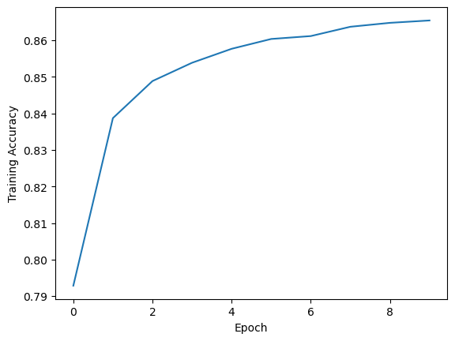

# Final Project: Sentiment Analysis

We will use the Yelp review dataset, which comprises around 174000 reviews with stars. We will be using only a subset of this dataset for experiments. Our goal is to implement the powerful Transformer model for sentiment analysis based on the text review and stars. 

Inside the “Final Project” folder on CANVAS, you can find two files, named ‘yelp review train.csv’ and ‘yelp review test.csv’. Each file contains a set of reviews posted by users on Yelp.

## (a) Data pre-processing: 
Pre-process the data by removing the punctuation and stopwords and converting all words to lowercase. Moreover, converting the stars into three levels: Positive > 3, negative <= 2, and neutral = 3. 
Note: You can use the nltk library from here: https://www.nltk.org/ to remove stop words. The regular expression may be helpful.


```python
import re
import nltk
from nltk.corpus import stopwords
import os
import numpy as np
import pandas as pd
from tensorflow.keras.preprocessing.text import Tokenizer
from tensorflow.keras.preprocessing.sequence import pad_sequences
import torch
import torch.nn as nn
import torch.nn.functional as F
import matplotlib.pyplot as plt
import torch.utils.data as Data
from sklearn.model_selection import train_test_split 
```


```python
# Load stop words 
nltk.download('stopwords')
nltk.download('punkt')
stop_words = set(stopwords.words('english'))

def preprocess_review(review):
    
    # Remove punctuation
    review = re.sub(r'[^\w\s]', '', review)
    
    # Convert to lowercase
    review = review.lower()
    
    # Remove stopwords
    review_words = review.split()
    filtered_words = [word for word in review_words if word not in stop_words]
    filtered_review = ' '.join(filtered_words)
    return filtered_review 

# define a function to convert star ratings to three levels
def convert_stars(stars):
    if stars > 3:
        return float(2) # 'Positive'
    elif stars <= 2:
        return float(1) #'Negative'
    else:
        return float(0) # 'Neutral'
```

    [nltk_data] Downloading package stopwords to C:\Users\MEI-KUEI
    [nltk_data]     LU\AppData\Roaming\nltk_data...
    [nltk_data]   Package stopwords is already up-to-date!
    [nltk_data] Downloading package punkt to C:\Users\MEI-KUEI
    [nltk_data]     LU\AppData\Roaming\nltk_data...
    [nltk_data]   Package punkt is already up-to-date!
    


```python
# read in the data
reviews = pd.read_csv('yelp_review_train.csv')

# preprocess the text
reviews['text'] = reviews['text'].apply(preprocess_review)

# convert the star ratings to three levels
reviews['sentiment'] = reviews['stars'].apply(convert_stars)

# drop the original star ratings column
#reviews = reviews.drop(columns=['stars']) 
```

## (b) Input data preparation: 
The input of the Transformer model is a fixed-length review sequence where integer numbers represent words. In this part, you need to build vocabulary for the dataset and pad the review data to a fixed length.


```python
# Assuming you have a list of reviews called 'text'
text = reviews['text'] 

tokenizer = Tokenizer(num_words=10000)  # Create a tokenizer with a vocabulary size of 10,000
tokenizer.fit_on_texts(text)  # Fit the tokenizer on the reviews

# Convert the reviews to sequences of integers
sequences = tokenizer.texts_to_sequences(text)

# Pad the sequences to a fixed length of 100 words (you can change this to any length you want)
padded_sequences = pad_sequences(sequences, maxlen=100, padding='post', truncating='post')
```


```python
padded_sequences
```


    array([[  37,  104,  152, ...,    0,    0,    0],
           [ 243,   43, 1704, ...,    0,    0,    0],
           [4501,  918, 5139, ...,    0,    0,    0],
           ...,
           [5576,  698, 4952, ...,    0,    0,    0],
           [  31,    3,  256, ...,    0,    0,    0],
           [ 125,    5,    1, ...,    0,    0,    0]])


```python
# combine the text in different rows into one string
text_list = reviews['text'].apply(lambda x: "".join(x)).to_list()
text_str = ' '.join(text_list) 
```


```python
# tokenize the text using nltk
tokens = nltk.word_tokenize(text_str)

# count the vocabulary size
vocab_size = len(set(tokens))
print(f"Vocabulary size: {vocab_size}") 
```

    Vocabulary size: 148262
    

## (c) Transformer implementation: 
Implement a Transformer model which is composed of an encoder network (i.e., multi-head self-attention layers) and a prediction head mapping the hidden representation of input sequence into the label space (i.e., three classes).
Note: You can find more details about Transformer at here https://arxiv.org/pdf/1706.03762.pdf. You may need to implement positional embeddings, a vocabulary embedding table, and mask indicators for padded tokens. Pytorch is recommended for model implementation. 


```python
import torch
import torch.nn as nn

class TransformerModel(nn.Module):
    def __init__(self, vocab_size, embed_dim, num_heads, hidden_dim, num_layers, output_dim, dropout):
        super(TransformerModel, self).__init__()
        
        self.embed_dim = embed_dim
        self.embedding = nn.Embedding(vocab_size, embed_dim)
        self.positional_encoding = PositionalEncoding(embed_dim, dropout)
        self.transformer_encoder = nn.TransformerEncoder(
            nn.TransformerEncoderLayer(embed_dim, num_heads, hidden_dim, dropout), num_layers)
        self.fc = nn.Linear(embed_dim, output_dim)
        self.dropout = nn.Dropout(dropout)
        
    def forward(self, src, src_mask=None):
        # Embedding
        src = self.embedding(src) * math.sqrt(self.embed_dim)
        src = self.positional_encoding(src)
        
        # Transformer Encoder
        src = self.transformer_encoder(src, src_mask)
        
        # Prediction Head
        mean_pooling = torch.mean(src, dim=1)
        out = self.dropout(mean_pooling)
        out = self.fc(out)
        return out 
```


```python
import math

class PositionalEncoding(nn.Module):
    def __init__(self, d_model, dropout=0.1, max_len=5000):
        super(PositionalEncoding, self).__init__()
        self.dropout = nn.Dropout(p=dropout)
        
        # Compute the positional encodings once in log space
        pe = torch.zeros(max_len, d_model)
        position = torch.arange(0, max_len, dtype=torch.float).unsqueeze(1)
        div_term = torch.exp(torch.arange(0, d_model, 2).float() * (-math.log(10000.0) / d_model))
        pe[:, 0::2] = torch.sin(position * div_term)
        pe[:, 1::2] = torch.cos(position * div_term)
        pe = pe.unsqueeze(0).transpose(0, 1)
        self.register_buffer('pe', pe)
        
    def forward(self, x):
        x = x + self.pe[:x.size(0), :]
        return self.dropout(x)

```

## (d) Model training: 
Train the model with stochastic gradient descent using mini-batch fashion based on the ‘yelp review train.csv’ dataset. Print the training curve, where the x-axis is the training epochs, and the y-axis is the training accuracy. Note: You can randomly sample a small set of training data as the validation set and save the best model with the highest validation accuracy.


```python
import torch.optim as optim

transformer_model = TransformerModel(vocab_size=vocab_size, embed_dim=100, hidden_dim=100, num_layers=2, num_heads=4, dropout=0.1, output_dim=3)

# Define the optimizer and loss function
optimizer = optim.SGD(transformer_model.parameters(), lr=0.001)
criterion = nn.CrossEntropyLoss()
```


```python
from sklearn.model_selection import train_test_split, GridSearchCV

x = padded_sequences
y = reviews['sentiment']

X_train, X_val, y_train, y_val = train_test_split(x, y, train_size=0.8)

print(X_train.shape), print(np.array(y_train).shape)
print(X_val.shape), print(np.array(y_val).shape)
```

    (139805, 100)
    (139805,)
    (34952, 100)
    (34952,)
    


    (None, None)


```python
# Define the batch size
batch_size = 32

# Define the number of epochs to train for
num_epochs = 10

# Define the validation set size
val_size = 0.2

torch_dataset = Data.TensorDataset(torch.from_numpy(X_train), torch.from_numpy(y_train.values))
val_torch_dataset = Data.TensorDataset(torch.from_numpy(X_val), torch.from_numpy(y_val.values)) 
```


```python
# Create data loaders for the train and validation sets
train_loader = torch.utils.data.DataLoader(torch_dataset, batch_size=batch_size, shuffle=True)
val_loader = torch.utils.data.DataLoader(val_torch_dataset, batch_size=batch_size, shuffle=True)

# Train the model 
train_losses = []
train_accs = []
valid_losses = []
valid_accs = []


best_val_acc = 0.0
for epoch in range(num_epochs):
    # Set the model to train mode
    transformer_model.train()
    
    # Initialize the total loss and number of correct predictions
    total_loss = 0.0
    total_correct = 0
    
    # Loop over the batches in the train loader
    for batch_idx, batch in enumerate(train_loader):
        # Zero the gradients
        optimizer.zero_grad()
        
        # Get the inputs and targets for the batch
        inputs, targets = batch
        
        # Pass the inputs through the model
        outputs = transformer_model(inputs)
        
        # Calculate the loss and update the total loss
        loss = criterion(outputs, targets)
        total_loss += loss.item()
        
        # Calculate the gradients and update the parameters
        loss.backward()
        optimizer.step()
        
        # Calculate the number of correct predictions and update the total number of correct predictions
        _, predicted = torch.max(outputs.data, 1)
        total_correct += (predicted == targets).sum().item()
    
    # Calculate the training accuracy
    train_acc = total_correct / len(torch_dataset)
 
    train_losses.append(total_loss)
    train_accs.append(train_acc)
    
    # Set the model to evaluation mode
    transformer_model.eval()
    
    # Initialize the validation loss and number of correct predictions
    val_loss = 0.0
    val_correct = 0
    
    # Loop over the batches in the validation loader
    with torch.no_grad():
        for batch_idx, batch in enumerate(val_loader):
            # Get the inputs and targets for the batch
            inputs, targets = batch
            
            # Pass the inputs through the model
            outputs = transformer_model(inputs)
            
            # Calculate the loss and update the validation loss
            loss = criterion(outputs, targets)
            val_loss += loss.item()
            
            # Calculate the number of correct predictions and update the total number of correct predictions
            _, predicted = torch.max(outputs.data, 1)
            val_correct += (predicted == targets).sum().item()
    
    # Calculate the validation accuracy
    val_acc = val_correct / len(val_torch_dataset)
    
    valid_losses.append(val_loss)
    valid_accs.append(val_acc)
    
    # Print the training and validation loss and accuracy
    print('Epoch {}/{}: Training Loss: {:.4f}, Training Acc: {:.4f}, Validation Loss: {:.4f}, Validation Acc: {:.4f}'.format(epoch+1, num_epochs, total_loss, train_acc, val_loss, val_acc))
    
    # Save the best model based on validation accuracy
    if val_acc > best_val_acc:
        best_val_acc = val_acc
        torch.save(transformer_model.state_dict(), 'best_model.pt')

```

    Epoch 1/10: Training Loss: 2410.0434, Training Acc: 0.7928, Validation Loss: 500.2407, Validation Acc: 0.8340
    Epoch 2/10: Training Loss: 1907.7725, Training Acc: 0.8387, Validation Loss: 455.0110, Validation Acc: 0.8463
    Epoch 3/10: Training Loss: 1782.0096, Training Acc: 0.8488, Validation Loss: 438.9805, Validation Acc: 0.8519
    Epoch 4/10: Training Loss: 1719.6892, Training Acc: 0.8538, Validation Loss: 432.4095, Validation Acc: 0.8537
    Epoch 5/10: Training Loss: 1677.3594, Training Acc: 0.8577, Validation Loss: 430.9770, Validation Acc: 0.8570
    Epoch 6/10: Training Loss: 1646.7009, Training Acc: 0.8604, Validation Loss: 433.0328, Validation Acc: 0.8541
    Epoch 7/10: Training Loss: 1629.3266, Training Acc: 0.8611, Validation Loss: 421.3900, Validation Acc: 0.8575
    Epoch 8/10: Training Loss: 1604.7907, Training Acc: 0.8637, Validation Loss: 421.6038, Validation Acc: 0.8585
    Epoch 9/10: Training Loss: 1585.0958, Training Acc: 0.8648, Validation Loss: 417.8829, Validation Acc: 0.8603
    Epoch 10/10: Training Loss: 1572.5400, Training Acc: 0.8654, Validation Loss: 423.4991, Validation Acc: 0.8570
    


```python
plt.plot(train_accs) 
plt.xlabel("Epoch")
plt.ylabel("Training Accuracy")
plt.show() 
```


    

    


## (e) Result analysis: 
Load the best model saved during training and report the accuracy of the model on the test set (i.e., ‘yelp review test.csv’). What are the impacts of hyper-parameters, such as the hidden dimension and the number of attention layers, on the Transformer?


```python
# Define the device to be used for training
device = torch.device('cuda' if torch.cuda.is_available() else 'cpu')
device 
```


    device(type='cpu')


Preprocess the test data 


```python
test_data = pd.read_csv('yelp_review_test.csv') 

# preprocess the text
test_data['text'] = test_data['text'].apply(preprocess_review)

# convert the star ratings to three levels
test_data['label'] = test_data['stars'].apply(convert_stars)

# drop the original star ratings column
test_data = test_data.drop(columns=['stars'])

# Save the dataframe as a CSV file 
test_data.to_csv('yelp_review_test_sentiment.csv', index=False) 
```


```python
test_data = pd.read_csv('yelp_review_test_sentiment.csv')
test_data 
```


<div>
<style scoped>
    .dataframe tbody tr th:only-of-type {
        vertical-align: middle;
    }

    .dataframe tbody tr th {
        vertical-align: top;
    }

    .dataframe thead th {
        text-align: right;
    }
</style>
<table border="1" class="dataframe">
  <thead>
    <tr style="text-align: right;">
      <th></th>
      <th>text</th>
      <th>label</th>
    </tr>
  </thead>
  <tbody>
    <tr>
      <th>0</th>
      <td>Hidden treasure! Awesome service, delicious fo...</td>
      <td>2.0</td>
    </tr>
    <tr>
      <th>1</th>
      <td>My family and I have been patients since I  wa...</td>
      <td>2.0</td>
    </tr>
    <tr>
      <th>2</th>
      <td>I rarely get pedicures, but Blue Nail's practi...</td>
      <td>2.0</td>
    </tr>
    <tr>
      <th>3</th>
      <td>We came with a large group, may of the items w...</td>
      <td>1.0</td>
    </tr>
    <tr>
      <th>4</th>
      <td>The view is great from Morgan's Pier. The bart...</td>
      <td>1.0</td>
    </tr>
    <tr>
      <th>...</th>
      <td>...</td>
      <td>...</td>
    </tr>
    <tr>
      <th>13975</th>
      <td>Amazing food and just opened a new place in Pr...</td>
      <td>2.0</td>
    </tr>
    <tr>
      <th>13976</th>
      <td>Thanks to the great planning of the store , we...</td>
      <td>2.0</td>
    </tr>
    <tr>
      <th>13977</th>
      <td>The classic NOLA white tablecloth dining exper...</td>
      <td>2.0</td>
    </tr>
    <tr>
      <th>13978</th>
      <td>After waiting for 15 minutes without so much a...</td>
      <td>1.0</td>
    </tr>
    <tr>
      <th>13979</th>
      <td>Had these guys come out to clean my gutters (2...</td>
      <td>2.0</td>
    </tr>
  </tbody>
</table>
<p>13980 rows × 2 columns</p>
</div>


```python
# Assuming you have a list of reviews called 'text'
text_test = test_data['text'] 

tokenizer = Tokenizer(num_words=10000)  # Create a tokenizer with a vocabulary size of 10,000
tokenizer.fit_on_texts(text_test)  # Fit the tokenizer on the reviews

# Convert the reviews to sequences of integers
sequences = tokenizer.texts_to_sequences(text_test)

# Pad the sequences to a fixed length of 100 words (you can change this to any length you want)
padded_sequences = pad_sequences(sequences, maxlen=100, padding='post', truncating='post')
```


```python
# combine the text in different rows into one string
text_test_list = test_data['text'].apply(lambda x: "".join(x)).to_list()
text_test_str = ' '.join(text_test_list) 

# tokenize the text using nltk
tokens = nltk.word_tokenize(text_test_str)

# count the vocabulary size
vocab_size = len(set(tokens))
print(f"Vocabulary size: {vocab_size}") 
```

    Vocabulary size: 43293
    


```python
# Define the optimizer and loss function
#optimizer = optim.SGD(transformer_model.parameters(), lr=0.001)
#criterion = nn.CrossEntropyLoss() 
criterion = nn.BCEWithLogitsLoss().to(device)
optimizer = torch.optim.Adam(model.parameters(), lr= 0.001)
```


```python
x = padded_sequences 
y = test_data['label'] 
```


```python
# Define the batch size
batch_size = 32

# Define the number of epochs to train for
num_epochs = 10

# Define the validation set size
# val_size = 0.2

# transform the test sets into torch dataset 
test_torch_dataset = Data.TensorDataset(torch.from_numpy(x), torch.from_numpy(y.values))
test_loader = torch.utils.data.DataLoader(test_torch_dataset, batch_size = batch_size, shuffle = False)

#torch_dataset = Data.TensorDataset(torch.from_numpy(X_train), torch.from_numpy(y_train.values))
#val_torch_dataset = Data.TensorDataset(torch.from_numpy(X_val), torch.from_numpy(y_val.values)) 
```


```python
# Create data loaders for the train and validation sets
#train_loader = torch.utils.data.DataLoader(torch_dataset, batch_size=batch_size, shuffle=True)
#val_loader = torch.utils.data.DataLoader(val_torch_dataset, batch_size=batch_size, shuffle=True)
#test_loader = torch.utils.data.DataLoader(test_torch_dataset, batch_size = batch_size, shuffle = False)


# Train the model 
train_losses = []
train_accs = []
valid_losses = []
valid_accs = []


best_val_acc = 0.0
for epoch in range(num_epochs):
    # Set the model to train mode
    transformer_model.train()
    
    # Initialize the total loss and number of correct predictions
    total_loss = 0.0
    total_correct = 0
    
    # Loop over the batches in the train loader
    for batch_idx, batch in enumerate(train_loader):
        # Zero the gradients
        optimizer.zero_grad()
        
        # Get the inputs and targets for the batch
        inputs, targets = batch
        
        # Pass the inputs through the model
        outputs = transformer_model(inputs)
        
        # Calculate the loss and update the total loss
        loss = criterion(outputs, targets)
        total_loss += loss.item()
        
        # Calculate the gradients and update the parameters
        loss.backward()
        optimizer.step()
        
        # Calculate the number of correct predictions and update the total number of correct predictions
        _, predicted = torch.max(outputs.data, 1)
        total_correct += (predicted == targets).sum().item()
    
    # Calculate the training accuracy
    train_acc = total_correct / len(torch_dataset)
 
    train_losses.append(total_loss)
    train_accs.append(train_acc)
    
    # Set the model to evaluation mode
    transformer_model.eval()
    
    # Initialize the validation loss and number of correct predictions
    val_loss = 0.0
    val_correct = 0
    
    # Loop over the batches in the validation loader
    with torch.no_grad():
        for batch_idx, batch in enumerate(val_loader):
            # Get the inputs and targets for the batch
            inputs, targets = batch
            
            # Pass the inputs through the model
            outputs = transformer_model(inputs)
            
            # Calculate the loss and update the validation loss
            loss = criterion(outputs, targets)
            val_loss += loss.item()
            
            # Calculate the number of correct predictions and update the total number of correct predictions
            _, predicted = torch.max(outputs.data, 1)
            val_correct += (predicted == targets).sum().item()
    
    # Calculate the validation accuracy
    val_acc = val_correct / len(val_torch_dataset)
    
    valid_losses.append(val_loss)
    valid_accs.append(val_acc)
    
    # Print the training and validation loss and accuracy
    print('Epoch {}/{}: Training Loss: {:.4f}, Training Acc: {:.4f}, Validation Loss: {:.4f}, Validation Acc: {:.4f}'.format(epoch+1, num_epochs, total_loss, train_acc, val_loss, val_acc))
    
    # Save the best model based on validation accuracy
    if val_acc > best_val_acc:
        best_val_acc = val_acc
        torch.save(transformer_model.state_dict(), 'best_model.pt')

```


```python

```


```python
# Load the saved model
model = TransformerModel(vocab_size=vocab_size, embed_dim=100, hidden_dim=100, num_layers=2, num_heads=4, dropout=0.1, output_dim=3)

# Load the saved model
model.load_state_dict(torch.load('best_model.pt'))
model.eval()
```


    TransformerModel(
      (embedding): Embedding(148262, 100)
      (positional_encoding): PositionalEncoding(
        (dropout): Dropout(p=0.1, inplace=False)
      )
      (transformer_encoder): TransformerEncoder(
        (layers): ModuleList(
          (0-1): 2 x TransformerEncoderLayer(
            (self_attn): MultiheadAttention(
              (out_proj): NonDynamicallyQuantizableLinear(in_features=100, out_features=100, bias=True)
            )
            (linear1): Linear(in_features=100, out_features=100, bias=True)
            (dropout): Dropout(p=0.1, inplace=False)
            (linear2): Linear(in_features=100, out_features=100, bias=True)
            (norm1): LayerNorm((100,), eps=1e-05, elementwise_affine=True)
            (norm2): LayerNorm((100,), eps=1e-05, elementwise_affine=True)
            (dropout1): Dropout(p=0.1, inplace=False)
            (dropout2): Dropout(p=0.1, inplace=False)
          )
        )
      )
      (fc): Linear(in_features=100, out_features=3, bias=True)
      (dropout): Dropout(p=0.1, inplace=False)
    )


```python
def evaluate(model, iterator, criterion):
    """
    Evaluate the model on a given dataset
    """
    epoch_loss = 0
    epoch_acc = 0

    model.eval()

    with torch.no_grad():
        for batch in iterator:
            text = batch.text 
            label = batch.label 

            predictions = model(text).squeeze(1)

            loss = criterion(predictions, label)
            acc = binary_accuracy(predictions, label)

            epoch_loss += loss.item()
            epoch_acc += acc.item()

    return epoch_loss / len(iterator), epoch_acc / len(iterator)
```


```python
for text, label in zip(x,y):
    # preprocess the text and convert to tensor
    text = TEXT.process([text]).to(device) 
    label = torch.tensor([label]).float().to(device) 
print(text) 
print(label)
```


    ---------------------------------------------------------------------------

    AttributeError                            Traceback (most recent call last)

    Cell In[192], line 3
          1 for text, label in zip(x,y):
          2     # preprocess the text and convert to tensor
    ----> 3     text = TEXT.process([text]).to(device)
          4     label = torch.tensor([label]).float().to(device)
          5 print(text)
    

    File ~\anaconda3\envs\test\lib\site-packages\pandas\core\generic.py:5902, in NDFrame.__getattr__(self, name)
       5895 if (
       5896     name not in self._internal_names_set
       5897     and name not in self._metadata
       5898     and name not in self._accessors
       5899     and self._info_axis._can_hold_identifiers_and_holds_name(name)
       5900 ):
       5901     return self[name]
    -> 5902 return object.__getattribute__(self, name)
    

    AttributeError: 'Series' object has no attribute 'process'


```python
# Load the saved model
#model = torch.load('best_model.pt')

# Evaluate the model on the test set
test_loss, test_acc = evaluate(model, test_loader, criterion)

# Print the test accuracy
print('Test Accuracy: {:.3f}'.format(test_acc))
print(f'Test Loss: {test_loss:.3f} | Test Acc: {test_acc*100:.2f}%')


#print(f'Test Loss: {test_loss:.3f} | Test Acc: {test_acc*100:.2f}%')

```


    ---------------------------------------------------------------------------

    AttributeError                            Traceback (most recent call last)

    Cell In[184], line 5
          1 # Load the saved model
          2 #model = torch.load('best_model.pt')
          3 
          4 # Evaluate the model on the test set
    ----> 5 test_loss, test_acc = evaluate(model, test_loader, criterion)
          7 # Print the test accuracy
          8 print('Test Accuracy: {:.3f}'.format(test_acc))
    

    Cell In[152], line 12, in evaluate(model, iterator, criterion)
         10 with torch.no_grad():
         11     for batch in iterator:
    ---> 12         text = batch.text
         13         label = batch.label
         15         predictions = model(text).squeeze(1)
    

    AttributeError: 'list' object has no attribute 'text'


```python
# Loop over the batches in the train loader
    for batch_idx, batch in enumerate(train_loader):
        # Zero the gradients
        optimizer.zero_grad()
        
        # Get the inputs and targets for the batch
        inputs, targets = batch
        
        # Pass the inputs through the model
        outputs = transformer_model(inputs)
        
        # Calculate the loss and update the total loss
        loss = criterion(outputs, targets)
        total_loss += loss.item()
        
        # Calculate the gradients and update the parameters
        loss.backward()
        optimizer.step()
        
        # Calculate the number of correct predictions and update the total number of correct predictions
        _, predicted = torch.max(outputs.data, 1)
        total_correct += (predicted == targets).sum().item()
    
    # Calculate the training accuracy
    train_acc = total_correct / len(torch_dataset)
 
    train_losses.append(total_loss)
    train_accs.append(train_acc)
```


```python

```


```python

```


```python

```


```python

```


```python

```


```python

```
