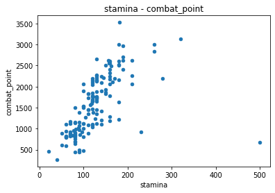
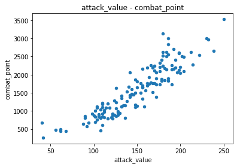
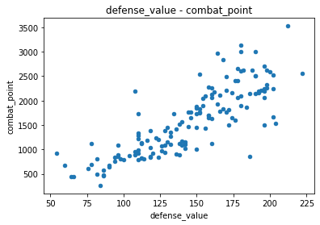
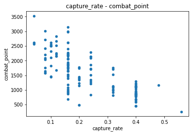
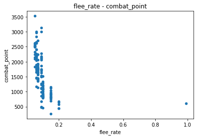
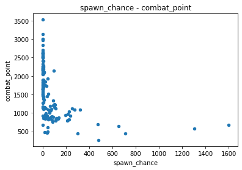
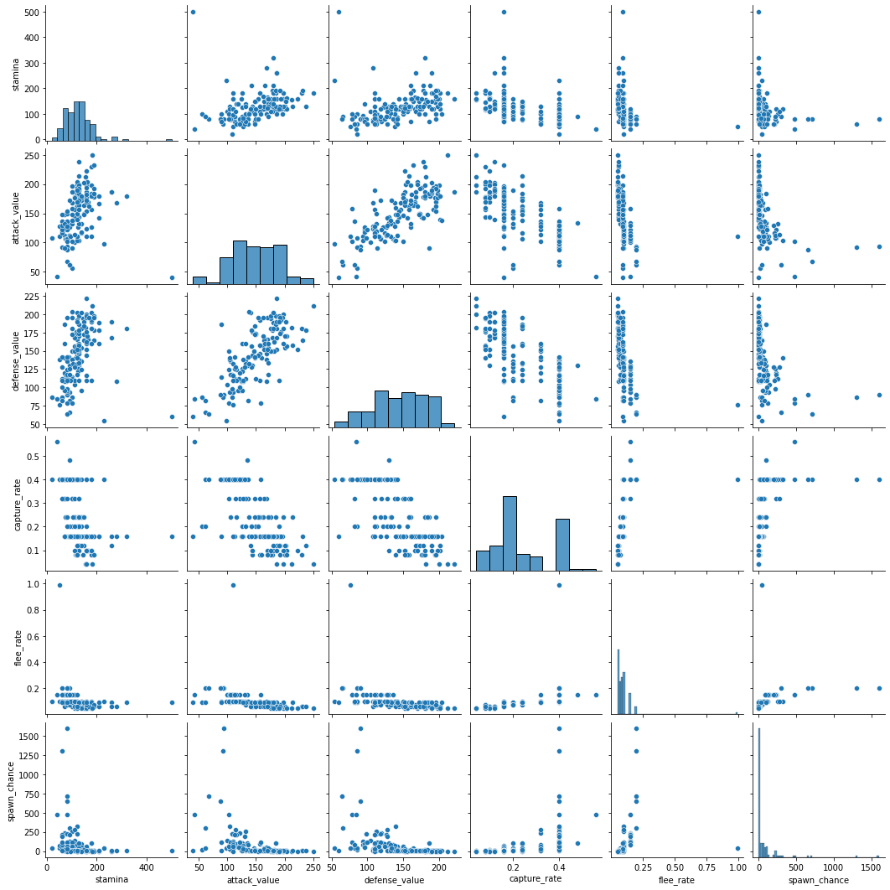

# HW2 - Linear Regression

## (i) Data exploration:


```python
import csv 
import pandas as pd
import numpy as np
import matplotlib.pyplot as plt
import seaborn as sns 
from sklearn.model_selection import KFold
```


```python
# read csv file 
data = []
data_path = "hw2_data.csv"

with open(data_path, 'r') as f:
    csv_file = csv.reader(f)
    data = [row for row in csv_file]
```


```python
df = pd.DataFrame(data)
new_header = df.iloc[0] # grab the first row for the header
df = df[1:] # take the data less the header row
df.columns = new_header
df
```


  <div id="df-a63cd45f-1bea-4853-92cc-5c3ded45f530">
    <div class="colab-df-container">
      <div>
<style scoped>
    .dataframe tbody tr th:only-of-type {
        vertical-align: middle;
    }

    .dataframe tbody tr th {
        vertical-align: top;
    }

    .dataframe thead th {
        text-align: right;
    }
</style>
<table border="1" class="dataframe">
  <thead>
    <tr style="text-align: right;">
      <th></th>
      <th>name</th>
      <th>stamina</th>
      <th>attack_value</th>
      <th>defense_value</th>
      <th>capture_rate</th>
      <th>flee_rate</th>
      <th>spawn_chance</th>
      <th>combat_point</th>
    </tr>
  </thead>
  <tbody>
    <tr>
      <th>1</th>
      <td>Bulbasaur</td>
      <td>90</td>
      <td>126</td>
      <td>126</td>
      <td>0.16</td>
      <td>0.1</td>
      <td>69</td>
      <td>1079</td>
    </tr>
    <tr>
      <th>2</th>
      <td>Ivysaur</td>
      <td>120</td>
      <td>156</td>
      <td>158</td>
      <td>0.08</td>
      <td>0.07</td>
      <td>4.2</td>
      <td>1643</td>
    </tr>
    <tr>
      <th>3</th>
      <td>Venusaur</td>
      <td>160</td>
      <td>198</td>
      <td>200</td>
      <td>0.04</td>
      <td>0.05</td>
      <td>1.7</td>
      <td>2598</td>
    </tr>
    <tr>
      <th>4</th>
      <td>Charmander</td>
      <td>78</td>
      <td>128</td>
      <td>108</td>
      <td>0.16</td>
      <td>0.1</td>
      <td>25.3</td>
      <td>962</td>
    </tr>
    <tr>
      <th>5</th>
      <td>Charmeleon</td>
      <td>116</td>
      <td>160</td>
      <td>140</td>
      <td>0.08</td>
      <td>0.07</td>
      <td>1.2</td>
      <td>1568</td>
    </tr>
    <tr>
      <th>...</th>
      <td>...</td>
      <td>...</td>
      <td>...</td>
      <td>...</td>
      <td>...</td>
      <td>...</td>
      <td>...</td>
      <td>...</td>
    </tr>
    <tr>
      <th>142</th>
      <td>Aerodactyl</td>
      <td>160</td>
      <td>182</td>
      <td>162</td>
      <td>0.16</td>
      <td>0.09</td>
      <td>1.8</td>
      <td>2180</td>
    </tr>
    <tr>
      <th>143</th>
      <td>Snorlax</td>
      <td>320</td>
      <td>180</td>
      <td>180</td>
      <td>0.16</td>
      <td>0.09</td>
      <td>1.6</td>
      <td>3135</td>
    </tr>
    <tr>
      <th>144</th>
      <td>Dratini</td>
      <td>82</td>
      <td>128</td>
      <td>110</td>
      <td>0.32</td>
      <td>0.09</td>
      <td>30</td>
      <td>990</td>
    </tr>
    <tr>
      <th>145</th>
      <td>Dragonair</td>
      <td>122</td>
      <td>170</td>
      <td>152</td>
      <td>0.08</td>
      <td>0.06</td>
      <td>2</td>
      <td>1760</td>
    </tr>
    <tr>
      <th>146</th>
      <td>Dragonite</td>
      <td>182</td>
      <td>250</td>
      <td>212</td>
      <td>0.04</td>
      <td>0.05</td>
      <td>0.11</td>
      <td>3525</td>
    </tr>
  </tbody>
</table>
<p>146 rows × 8 columns</p>
</div>
      <button class="colab-df-convert" onclick="convertToInteractive('df-a63cd45f-1bea-4853-92cc-5c3ded45f530')"
              title="Convert this dataframe to an interactive table."
              style="display:none;">

  <svg xmlns="http://www.w3.org/2000/svg" height="24px"viewBox="0 0 24 24"
       width="24px">
    <path d="M0 0h24v24H0V0z" fill="none"/>
    <path d="M18.56 5.44l.94 2.06.94-2.06 2.06-.94-2.06-.94-.94-2.06-.94 2.06-2.06.94zm-11 1L8.5 8.5l.94-2.06 2.06-.94-2.06-.94L8.5 2.5l-.94 2.06-2.06.94zm10 10l.94 2.06.94-2.06 2.06-.94-2.06-.94-.94-2.06-.94 2.06-2.06.94z"/><path d="M17.41 7.96l-1.37-1.37c-.4-.4-.92-.59-1.43-.59-.52 0-1.04.2-1.43.59L10.3 9.45l-7.72 7.72c-.78.78-.78 2.05 0 2.83L4 21.41c.39.39.9.59 1.41.59.51 0 1.02-.2 1.41-.59l7.78-7.78 2.81-2.81c.8-.78.8-2.07 0-2.86zM5.41 20L4 18.59l7.72-7.72 1.47 1.35L5.41 20z"/>
  </svg>
      </button>

  <style>
    .colab-df-container {
      display:flex;
      flex-wrap:wrap;
      gap: 12px;
    }

    .colab-df-convert {
      background-color: #E8F0FE;
      border: none;
      border-radius: 50%;
      cursor: pointer;
      display: none;
      fill: #1967D2;
      height: 32px;
      padding: 0 0 0 0;
      width: 32px;
    }

    .colab-df-convert:hover {
      background-color: #E2EBFA;
      box-shadow: 0px 1px 2px rgba(60, 64, 67, 0.3), 0px 1px 3px 1px rgba(60, 64, 67, 0.15);
      fill: #174EA6;
    }

    [theme=dark] .colab-df-convert {
      background-color: #3B4455;
      fill: #D2E3FC;
    }

    [theme=dark] .colab-df-convert:hover {
      background-color: #434B5C;
      box-shadow: 0px 1px 3px 1px rgba(0, 0, 0, 0.15);
      filter: drop-shadow(0px 1px 2px rgba(0, 0, 0, 0.3));
      fill: #FFFFFF;
    }
  </style>

      <script>
        const buttonEl =
          document.querySelector('#df-a63cd45f-1bea-4853-92cc-5c3ded45f530 button.colab-df-convert');
        buttonEl.style.display =
          google.colab.kernel.accessAllowed ? 'block' : 'none';

        async function convertToInteractive(key) {
          const element = document.querySelector('#df-a63cd45f-1bea-4853-92cc-5c3ded45f530');
          const dataTable =
            await google.colab.kernel.invokeFunction('convertToInteractive',
                                                     [key], {});
          if (!dataTable) return;

          const docLinkHtml = 'Like what you see? Visit the ' +
            '<a target="_blank" href=https://colab.research.google.com/notebooks/data_table.ipynb>data table notebook</a>'
            + ' to learn more about interactive tables.';
          element.innerHTML = '';
          dataTable['output_type'] = 'display_data';
          await google.colab.output.renderOutput(dataTable, element);
          const docLink = document.createElement('div');
          docLink.innerHTML = docLinkHtml;
          element.appendChild(docLink);
        }
      </script>
    </div>
  </div>


```python
# convert data types 
features = df.columns[1:]

for i in range(0,7): 
    df[features[i]] = df[features[i]].astype(float)
```


```python
# plot 2-D scatter plot 
for i in range(0,6):
    df.plot(x = features[i], y = features[6], kind = "scatter")
    plt.title(f"{features[i]} - {features[6]}")
    plt.show()
```


    

    


    

    


    

    


    

    


    

    


    

    


```python
# Pearson's correlation coefficient
data_arr = np.array(df)
arr_features = data_arr[:, 1:7].astype(dtype=np.float64)
combat_points = data_arr[:, 7].astype(dtype=np.float64)

corr_coef = []
for i in range(0,6):
    corr_coef.append(np.corrcoef(arr_features[:,i], combat_points)[0,1])

for i in range(0,6):
    print(f"The Pearson's correlation coefficient between {features[i]} and combat points is: {corr_coef[i]}")
```

    The Pearson's correlation coefficient between stamina and combat points is: 0.5828317032229264
    The Pearson's correlation coefficient between attack_value and combat points is: 0.9075315401042738
    The Pearson's correlation coefficient between defense_value and combat points is: 0.8262293053572933
    The Pearson's correlation coefficient between capture_rate and combat points is: -0.7430078083529389
    The Pearson's correlation coefficient between flee_rate and combat points is: -0.40703421142159657
    The Pearson's correlation coefficient between spawn_chance and combat points is: -0.42132699465983625
    

Which features are the most predictive of the number of combat points?

The Pearson's correlation coefficient between attack_value and combat points is: 0.907. Thus, **attack_value** is the most predictive of the number of combat points.

## (ii) Data exploration:


```python
df_features = df[features].iloc[:,0:6]
sns.pairplot(df_features)
```


    <seaborn.axisgrid.PairGrid at 0x7f99dee98e20>


    

    


```python
corr_coef2 = []
for i in range(0,6):
    for j in range(i+1,6): 
        corr_coef2.append(np.corrcoef(arr_features[:,i], arr_features[:,j])[0,1])
```


```python
# Pearson's correlation coefficient

k = 0
for i in range(0,6):
     for j in range(i+1,6): 
        print(f"The Pearson's correlation coefficient between {features[i]} and {features[j]} is: {corr_coef2[k]}")
        k += 1
```

    The Pearson's correlation coefficient between stamina and attack_value is: 0.3029949826738915
    The Pearson's correlation coefficient between stamina and defense_value is: 0.3026633362536891
    The Pearson's correlation coefficient between stamina and capture_rate is: -0.4468503047144595
    The Pearson's correlation coefficient between stamina and flee_rate is: -0.27104753932483927
    The Pearson's correlation coefficient between stamina and spawn_chance is: -0.27642020788360366
    The Pearson's correlation coefficient between attack_value and defense_value is: 0.7367766467515232
    The Pearson's correlation coefficient between attack_value and capture_rate is: -0.6905726716022129
    The Pearson's correlation coefficient between attack_value and flee_rate is: -0.3690641419760069
    The Pearson's correlation coefficient between attack_value and spawn_chance is: -0.43264844020108706
    The Pearson's correlation coefficient between defense_value and capture_rate is: -0.6972657162131638
    The Pearson's correlation coefficient between defense_value and flee_rate is: -0.423859756237293
    The Pearson's correlation coefficient between defense_value and spawn_chance is: -0.4324985620833201
    The Pearson's correlation coefficient between capture_rate and flee_rate is: 0.4405115072805946
    The Pearson's correlation coefficient between capture_rate and spawn_chance is: 0.47279272664456745
    The Pearson's correlation coefficient between flee_rate and spawn_chance is: 0.29322169222082045
    

Which features are the most correlated to each other?

The Pearson's correlation coefficient between attack_value and defense_value is: 0.73, which is the highest among the others. Thus, **attack_value** and **defense_value** are the most correlated to each other.

## (iii) Predicting combat points:


```python
def OLS(x, y, lam=0, norm=None):
    x = np.concatenate((np.ones([x.shape[0], 1]), x), axis = 1).astype(float)
    if not norm:
        w_star = np.linalg.pinv(x.T.dot(x)).dot(x.T).dot(y)
    elif norm == 'l2':
        w_star = np.linalg.pinv(x.T.dot(x) + lam * np.ones([x.shape[1], x.shape[1]])).dot(x.T).dot(y)
    return w_star
```


```python
def cv_rss(input_arr_x, input_y, lam=0, norm=None, n_splits=5, shuffle=True, random_state=9):
    kf = KFold(n_splits=n_splits, shuffle=shuffle, random_state=random_state)

    rss_list = []
    num_fold = 1
    for train_index, test_index in kf.split(input_arr_x):
        # generate 5-folder cross-validation
        x_train, x_test = input_arr_x[train_index], input_arr_x[test_index]
        y_train, y_test = input_y[train_index], input_y[test_index]

        # gen the model weight via OLS
        w_star = OLS(x_train, y_train, lam=lam, norm=norm)

        # evaluate by RSS
        x_test = np.concatenate((np.ones([x_test.shape[0], 1]), x_test), axis = 1).astype(float)
        y_hat = x_test.dot(w_star)
        rss = np.sum(np.square(y_hat - y_test))
        rss_list.append(rss)
        num_fold += 1
        
    avg_rss = sum(rss_list) / len(rss_list)
    return avg_rss, rss_list
```


```python
avg_rss, rss_list = cv_rss(arr_features, combat_points)
for i, rss in enumerate(rss_list):
    print(f"The No.{i + 1} fold RSS: {rss}")
print(f"The average RSS: {avg_rss}")
```

    The No.1 fold RSS: 2430498.2770043756
    The No.2 fold RSS: 396402.14649811725
    The No.3 fold RSS: 225329.3270441172
    The No.4 fold RSS: 277107.4607048518
    The No.5 fold RSS: 872859.7436398102
    The average RSS: 840439.3909782544
    

## (iv) Report 

Based on your findings from questions (i) and (ii), use linear regression and experiment with different feature combinations. Please report your results.


```python
print(f"Features: {list(features[0:-1])}")
print("")

# stamina
print("RSS with stamina")
arr_x0 = np.expand_dims(arr_features[:, 0], axis=1)
avg_rss, rss_list = cv_rss(arr_x0, combat_points)
print(f"The average RSS: {avg_rss}")
print("")

# attack_value
print("RSS with attack_value")
arr_x1 = np.expand_dims(arr_features[:, 1], axis=1)
avg_rss, rss_list = cv_rss(arr_x1, combat_points)
print(f"The average RSS: {avg_rss}")
print("")

# defense_value
print("RSS with defense_value")
arr_x2 = np.expand_dims(arr_features[:, 2], axis=1)
avg_rss, rss_list = cv_rss(arr_x2, combat_points)
print(f"The average RSS: {avg_rss}")
print("")

# capture_rate
print("RSS with capture_rate")
arr_x3 = np.expand_dims(arr_features[:, 3], axis=1)
avg_rss, rss_list = cv_rss(arr_x3, combat_points)
print(f"The average RSS: {avg_rss}")
print("")

# flee_rate
print("RSS with flee_rate")
arr_x4 = np.expand_dims(arr_features[:, 4], axis=1)
avg_rss, rss_list = cv_rss(arr_x4, combat_points)
print(f"The average RSS: {avg_rss}")
print("")

# spawn_chance
print("RSS with spawn_chance")
arr_x5 = np.expand_dims(arr_features[:, 5], axis=1)
avg_rss, rss_list = cv_rss(arr_x5, combat_points)
print(f"The average RSS: {avg_rss}")
print("")

# attack_value, defense_value
print("RSS with attack_value, defense_value")
arr_x12 = arr_features[:, [1, 2]]
avg_rss, rss_list = cv_rss(arr_x12, combat_points)
print(f"The average RSS: {avg_rss}")
print("")

# attack_value, defense_value, capture_rate
print("RSS with attack_value, defense_value, capture_rate")
arr_x123 = arr_features[:, [1, 2, 3]]
avg_rss, rss_list = cv_rss(arr_x123, combat_points)
print(f"The average RSS: {avg_rss}")
print("")

# attack_value, defense_value, capture_rate, stamina
print("RSS with attack_value, defense_value, capture_rate, stamina")
arr_x0123 = arr_features[:, [0, 1, 2, 3]]
avg_rss, rss_list = cv_rss(arr_x0123, combat_points)
print(f"The average RSS: {avg_rss}")
print("")

# attack_value, defense_value, capture_rate, stamina, spawn_chance
print("RSS with attack_value, defense_value, capture_rate, stamina, spawn_chance")
arr_x01235 = arr_features[:, [0, 1, 2, 3, 5]]
avg_rss, rss_list = cv_rss(arr_x01235, combat_points)
print(f"The average RSS: {avg_rss}")
print("")

# attack_value, defense_value, capture_rate, stamina, spawn_chance, flee_rate
print("RSS with attack_value, defense_value, capture_rate, stamina, spawn_chance, flee_rate")
arr_x012345 = arr_features[:, [0, 1, 2, 3, 4, 5]]
avg_rss, rss_list = cv_rss(arr_x012345, combat_points)
print(f"The average RSS: {avg_rss}")
print("")
```

    Features: ['stamina', 'attack_value', 'defense_value', 'capture_rate', 'flee_rate', 'spawn_chance']
    
    RSS with stamina
    The average RSS: 12826334.77637716
    
    RSS with attack_value
    The average RSS: 2516834.8210286116
    
    RSS with defense_value
    The average RSS: 4538667.106331734
    
    RSS with capture_rate
    The average RSS: 6418539.061260773
    
    RSS with flee_rate
    The average RSS: 43364103.18390721
    
    RSS with spawn_chance
    The average RSS: 11940895.670028608
    
    RSS with attack_value, defense_value
    The average RSS: 1771085.451215248
    
    RSS with attack_value, defense_value, capture_rate
    The average RSS: 1700992.023141612
    
    RSS with attack_value, defense_value, capture_rate, stamina
    The average RSS: 889921.2526775363
    
    RSS with attack_value, defense_value, capture_rate, stamina, spawn_chance
    The average RSS: 843649.734670965
    
    RSS with attack_value, defense_value, capture_rate, stamina, spawn_chance, flee_rate
    The average RSS: 840439.3909782544
    
    

### Report
From Pearson's correlation coefficient between features and combat points, we know that **attack_value** and **defense_value** are the most correlated to the number of combat points. Also, **attack_value** and **defense_value** have the lowest RSS. Thus, it's essential to include them in the model. After the experiment of different feature combinations, model with **all features** has the lowest RSS.
