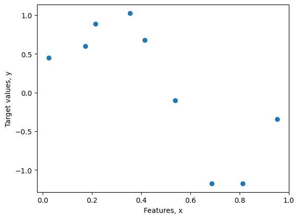
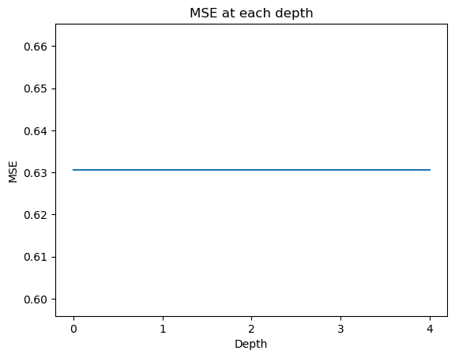
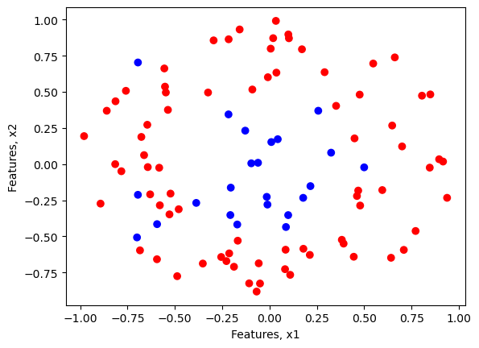
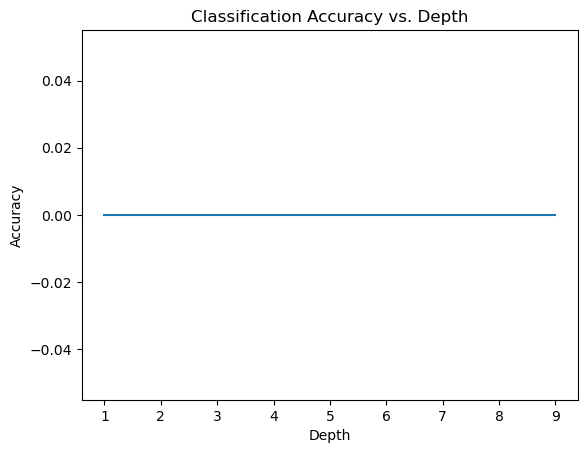

# CSCE 633 :: Machine Learning :: Texas A&M University :: Spring 2023

# Homework 4 (HW-4)
**Name:** Mei-Kuei Lu 
**UIN:** 432001991
**Due on Wed, Mar 8, by 11:59 PM.**

* Please finish your homework in this file with **Python**.
* For your submission please name the files with ***last name_first name_hw4_csce633***. No late submissions accepted unless you have slip days remaining.
* This is an individual assignment. While you are welcome to discuss general concepts together and on the discussion board your solutions must be yours and yours alone.
* SHOW YOUR WORK.

## Problem: Regression and Classification Trees

In this assignment, you'll be coding up regression and classification trees from scratch. Trees are a special class of graphs with only directed edges sans any cycles. They fall under the category of directed acyclic graphs or DAGs. So, trees are DAGs where each child node has only one parent node.  

Since trees are easy to design recursively, it is super important that you're familiar with **recursion**. So, it is highly recommended that you brush up on recursion and tree-based search algorithms such as depth-first search (BFS) and breadth-first search (BFS). 

### Instructions
- You are **NOT** allowed to use machine learning libraries such as scikit-learn to build regression and classification trees for this assignment.
- You are required to complete the functions defined in the code blocks following each question. Fill out sections of the code marked `"YOUR CODE HERE"`.
- Download the datasets `noisy_sin_subsample_2.csv` [here](https://github.com/jermwatt/machine_learning_refined/blob/gh-pages/mlrefined_datasets/nonlinear_superlearn_datasets/noisy_sin_subsample_2.csv) and `new_circle_data.csv` [here](https://github.com/jermwatt/machine_learning_refined/blob/gh-pages/mlrefined_datasets/nonlinear_superlearn_datasets/new_circle_data.csv).
- You're free to change the definition of the methods and the name of the methods within each class. 
- You may also add any number of additional code blocks that you deem necessary. 
- Once you've filled out your solutions, submit the notebook on Canvas.
- Do **NOT** forget to type in your name and UIN at the beginning of the notebook.

Below is a suggested sequence of steps you may want to think along for building regression and classification trees.

1. **Defining a criteria for splitting.**
    1. This criteria assigns a score to a split.
    1. For regression trees, this would be the mean squared error.
    2. For decision trees, this would be the Gini index or entropy.
2. **Create the split.**
    1. Split the dataset by iterating over all the rows and feature columns.
    2. Evaluate all the splits using the splitting criteria.
    3. Choose the best split.
3. **Build the tree.**
    1. Terminal nodes: decide when to stop growing a tree. This would be the maximum allowed depth of the tree or when a leaf is empty or has only 1 element.
    2. Recursive splitting: once a split is created, you can split it further recursively by calling the same splitting function on it.
    3. Building a tree: create a root node and apply recursive splitting on it.
4. **Make predictions with the tree.**
    1. For a given data point, make a prediction using the tree.

#### (1) (50 points) Growing a maximum-depth regression tree

The recursive procedure for growing a deep regression tree is illustrated in the figure below. We begin (on the left) by fitting a stump to the original dataset. As we move from left to right the recursion proceeds, with each leaf of the preceding tree split in order to create the next, deeper tree. As can be seen in the rightmost panel, a tree with maximum depth of four is capable of representing the training data perfectly.  


**Peform the experiment shown in the figure by coding up a recursively defined regression tree. Instead of reproducing the plot, measure and plot the mean squared error (MSE) at each depth of your tree.**


```python
# Importing Libraries
import numpy as np
import pandas as pd
import matplotlib.pyplot as plt
%matplotlib inline
```


```python
csvname = 'noisy_sin_subsample_2.csv' # Place the CSV file in the same directory as this notebook
data_regress = np.loadtxt(csvname, delimiter = ',')
data_regress = np.array([[x, y] for x,y in zip(*data_regress)])
```


```python
# Plot the data
plt.figure()
plt.scatter(data_regress[:, 0], data_regress[:, 1])
plt.xlabel("Features, x")
plt.ylabel("Target values, y")
plt.show()
```


    

    


**Build the regression tree in the `TreeRegressor` class**.  
***TIP:*** *If you are smart about building the regression tree, you can reuse most of the code for building the classification tree in Question 2.*


```python
class TreeRegressor():
    def __init__(self, data, max_depth=1):
        self.data = data # last element of each row in data is the target variable
        self.max_depth = max_depth # maximum depth
        # YOU MAY ADD ANY OTHER VARIABLES THAT YOU NEED HERE
        ## YOUR CODE HERE
    
    # Build the recursive 
    def build_tree(self):
        ## YOUR CODE HERE
    
    # Calculate the mean squared error for a split dataset
    def mean_squared_error(self, splits):
        ## YOUR CODE HERE
```

Don't forget to create a method to make predictions using your tree. You may create a separate function for it or make it a part of the `TreeRegressor` class.  
**Plot the MSE at each depth of your tree**


```python
## YOUR CODE HERE

import numpy as np
import matplotlib.pyplot as plt

class TreeRegressor:
    def __init__(self, X=None, y=None, max_depth=None, min_samples_split=2):
        self.X = X
        self.y = y
        self.max_depth = max_depth
        self.min_samples_split = min_samples_split
        self.tree = None

    def mse(self, y_left, y_right):
        return (len(y_left) * np.mean((y_left - np.mean(y_left))**2) +
                len(y_right) * np.mean((y_right - np.mean(y_right))**2)) / len(y_left) + len(y_right)

    def build_tree(self, X, y, depth=0):
        if self.max_depth is not None and depth >= self.max_depth:
            return np.mean(y)

        if len(X) < self.min_samples_split:
            return np.mean(y)

        best_feature, best_value = self.find_best_split(X, y)

        if best_feature is None or best_value is None:
            return np.mean(y)

        left_idx = X[:, best_feature] < best_value
        X_left, y_left = X[left_idx], y[left_idx]
        X_right, y_right = X[~left_idx], y[~left_idx]

        tree_node = {
            "feature": best_feature,
            "value": best_value,
            "left": self.build_tree(X_left, y_left, depth+1),
            "right": self.build_tree(X_right, y_right, depth+1),
        }
        return tree_node

    def find_best_split(self, X, y):
        best_feature = None
        best_value = None
        best_mse = np.inf

        n_features = X.shape[0]
        for feature in range(n_features):
            feature_values = np.unique(X[feature])
            for value in feature_values:
                left_idx = X[feature] < value
                y_left = y[left_idx]
                y_right = y[~left_idx]

                if len(y_left) == 0 or len(y_right) == 0:
                    continue

                mse = self.mse(y_left, y_right)
                if mse < best_mse:
                    best_feature = feature
                    best_value = value
                    best_mse = mse

        return best_feature, best_value

    def fit(self):
        self.tree = self.build_tree(self.X, self.y)
        mse_by_depth = {}
        for depth in range(self.max_depth + 1):
            y_pred = self.predict(self.X, depth)
            mse = np.mean((self.y - y_pred) ** 2)
            mse_by_depth[depth] = mse
        return mse_by_depth

    def predict(self, X, depth=None):
        if depth is None:
            depth = self.max_depth

        def predict_tree(tree_node, x):
            if isinstance(tree_node, dict):
                if x[tree_node["feature"]] < tree_node["value"]:
                    return predict_tree(tree_node["left"], x)
                else:
                    return predict_tree(tree_node["right"], x)
            else:
                return tree_node

        y_pred = []
        for x in X:
            y_pred.append(predict_tree(self.tree, x))
        return np.array(y_pred)
```


```python
X = data_regress[:, 0]
y = data_regress[:, 1]
# Fit the tree with max depth 4 and min_samples_split 2
tree = TreeRegressor(X = X, y = y, max_depth = 4, min_samples_split = 2)
mse_by_depth = tree.fit()

# Plot the MSE at each depth
plt.plot(list(mse_by_depth.keys()), list(mse_by_depth.values()))
plt.xticks(np.arange(0, 5, 1))
plt.xlabel('Depth')
plt.ylabel('MSE')
plt.title('MSE at each depth')
plt.show() 
```


    

    


#### (2) (50 points)

## Growing a two-class classification tree

The figure below shows the growth of a tree to a maximum depth of seven on a two-class classification dataset. As the tree grows, note how many parts of the input space do not change as leaves on the deeper branches become *pure*. By the time we reach a maximum depth of seven, there is considerable overfitting. 


**Perform the experiment shown in figure by coding up a recursively defined two-class classification tree. Instead of reproducing the plot, measure and plot the classification accuracy at each depth of your tree.**


```python
csvname = 'new_circle_data.csv' # Place the CSV file in the same directory as this notebook
data_class = np.loadtxt(csvname, delimiter = ',')
data_class = np.array([[x1, x2, y] for x1,x2,y in zip(*data_class)])
```


```python
# Plot the data
plt.figure()
plt.scatter(data_class[:, 0], data_class[:, 1], c=-data_class[:, 2], cmap='bwr')
plt.xlabel("Features, x1")
plt.ylabel("Features, x2")
plt.show()
```


    

    


```python
# TreeClassifier is a derived class of TreeRegressor

class TreeClassifier(TreeRegressor):
    def build_tree(self):
        ## YOUR CODE HERE
    
    # Calculate the Gini index for a split dataset
    def gini_index(self, splits):
        ## YOUR CODE HERE. Don't forget to create a method to make predictions using your tree.  
**Plot the classification accuracy at each depth of your tree.**
```

Don't forget to create a method to make predictions using your tree.  
**Plot the classification accuracy at each depth of your tree.**


```python
## YOUR CODE HERE

class TreeClassifier:
    def __init__(self, split_feature=None, split_value=None, left=None, right=None, depth=0, is_leaf=False, class_label=None):
        self.split_feature = split_feature
        self.split_value = split_value
        self.left = left
        self.right = right
        self.depth = depth
        self.is_leaf = is_leaf
        self.class_label = class_label

class ClassificationTree:
    def __init__(self, max_depth=10, min_samples_split=2):
        self.max_depth = max_depth
        self.min_samples_split = min_samples_split

    def gini_impurity(self, y):
        # Calculate class frequencies
        freqs = np.bincount(y)

        # Calculate proportion of each class in the data
        proportions = freqs / len(y)

        # Calculate Gini impurity
        impurity = 1 - np.sum(proportions ** 2)

        return impurity.astype('float64')

    def information_gain(self, X, y, split_feature, split_value):
        # Split data based on feature and value
        left_indices = X[split_feature] <= split_value
        right_indices = X[split_feature] > split_value
        left_y = y[left_indices]
        right_y = y[right_indices]

        # Calculate parent Gini impurity
        parent_impurity = self.gini_impurity(y)

        # Calculate child Gini impurities
        left_impurity = self.gini_impurity(left_y)
        right_impurity = self.gini_impurity(right_y)

        # Calculate information gain
        gain = parent_impurity - (len(left_y) / len(y) * left_impurity + len(right_y) / len(y) * right_impurity)

        return gain

    def get_best_split(self, X, y):
        best_feature = None
        best_value = None
        best_gain = 0

        # Stopping criterion: stop if minimum number of samples is reached
        if len(y) < self.min_samples_split:
            return best_feature, best_value, best_gain

        # Loop over all features and possible split values
        for feature in range(X.shape[0]):
            values = np.unique(X[feature])
            for value in values:
                # Calculate information gain for the split
                gain = self.information_gain(X, y, feature, value)

                # Update best feature and value if information gain is higher
                if gain > best_gain:
                    best_feature = feature
                    best_value = value
                    best_gain = gain

        return best_feature, best_value, best_gain

    def fit(self, X, y):
        self.root = self.build_tree(X, y, 0)
    
    def build_tree(self, X, y, depth):
        # Stopping criterion: stop if max depth is reached or if all samples have the same class
        if depth == self.max_depth or len(set(y)) == 1:
            class_label = np.bincount(y).argmax()
            return Node(is_leaf=True, class_label=class_label)

        # Get the best split
        split_feature, split_value, gain = self.get_best_split(X, y)

        # Stopping criterion: stop if no split improves information gain
        if gain == 0:
            class_label = np.bincount(y).argmax()
            return Node(is_leaf=True, class_label=class_label)

        # Create child nodes for the split
        left_indices = X[:, split_feature] <= split_value
        right_indices = X[:, split_feature] > split_value
        left = self.build_tree(X[left_indices], y[left_indices], depth+1)
```


```python
X = data_class[:, [0]].reshape(-1, 1)
y = data_class[:, 2].reshape(-1, 1)

depths = np.arange(1,  10)
accuracies = np.zeros(len(depths))

for i, depth in enumerate(depths):
    tree = ClassificationTree(0, depth)
    accuracy = tree.fit(X, y)
    y_pred = tree.predict(X_test)
    accuracies[i] = classification_accuracy(y_test, y_pred)
```


    ---------------------------------------------------------------------------

    ValueError                                Traceback (most recent call last)

    Cell In[17], line 9
          7 for i, depth in enumerate(depths):
          8     tree = ClassificationTree(0, depth)
    ----> 9     accuracy = tree.fit(X, y)
         10     y_pred = tree.predict(X_test)
         11     accuracies[i] = classification_accuracy(y_test, y_pred)
    

    Cell In[16], line 74, in ClassificationTree.fit(self, X, y)
         73 def fit(self, X, y):
    ---> 74     self.root = self.build_tree(X, y, 0)
    

    Cell In[16], line 79, in ClassificationTree.build_tree(self, X, y, depth)
         76 def build_tree(self, X, y, depth):
         77     # Stopping criterion: stop if max depth is reached or if all samples have the same class
         78     if depth == self.max_depth or len(set(y)) == 1:
    ---> 79         class_label = np.bincount(y).argmax()
         80         return Node(is_leaf=True, class_label=class_label)
         82     # Get the best split
    

    File <__array_function__ internals>:180, in bincount(*args, **kwargs)
    

    ValueError: object too deep for desired array


```python
plt.plot(depths, accuracies)
plt.title('Classification Accuracy vs. Depth')
plt.xlabel('Depth')
plt.ylabel('Accuracy')
plt.show()
```


    

    

