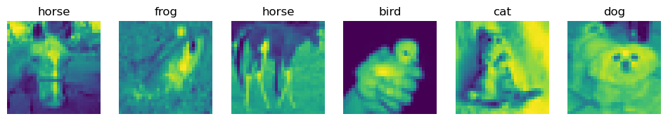

# HW 6: Neural Networks

## Question 1: Machine learning for object recognition

In this problem, we will process images coming from the CIFAR-10 dataset consists of 60000 32x32 color images in 10 classes (i.e., airplane, automobile, bird, cat, deer, dog, frog, horse, ship, truck) with 6000 images per class. There are 50000 training images and 10000 test images. More information about the data can be found here: https://www.cs.toronto.edu/~kriz/cifar.html.

The CIFAR-10 dataset is included in most of the frameworks for deep neural networks e.g., Keras, Tensorflow, PyTorch. In Keras, CIFAR-10 can be downloaded by running:


```python
from keras.datasets import cifar10
# load the dataset
(X_train, y_train), (X_test, y_test) = cifar10.load_data()
```

Note: The original CIFAR-10 with color images can take a long time to train. Hence, we will convert the color images into grayscale images. One way to achieve this would be to use a library such as scikit-image.


```python
from skimage.color import rgb2gray
# convert to grayscale images
X_train = rgb2gray(X_train)
X_test = rgb2gray(X_test)
```

## (a) Visualization
Randomly select and visualize 5-6 images (no need to include all the classes). 
Note: You can find a useful link on image pre-processing here: https://www.tensorflow.org/api_docs/python/tf/image/per_image_standardization 


```python
import matplotlib.pyplot as plt
import numpy as np
from keras.models import Sequential
from keras.layers import Dense, Flatten, Conv2D, MaxPooling2D, Dropout
from keras.utils import to_categorical
from sklearn.metrics import confusion_matrix
```


```python
# Define the class names
class_names = ['airplane', 'automobile', 'bird', 'cat', 'deer', 'dog', 'frog', 'horse', 'ship', 'truck']

# Define the number of images to visualize
num_images = 6

# Select num_images random indices from the training set
random_indices = np.random.choice(X_train.shape[0], num_images, replace=False)

# Create a figure with num_images subplots
fig, axes = plt.subplots(1, num_images, figsize=(12, 4))

# Loop over the selected indices and plot the corresponding images
for i, index in enumerate(random_indices):
    # Get the image and its label
    image = X_train[index]
    label = y_train[index][0]
    
    # Set the title to the class name
    title = class_names[label]
    
    # Plot the image
    axes[i].imshow(image)
    axes[i].set_title(title)
    axes[i].axis('off')
    
# Show the figure
plt.show()
```


    

    


## (b) Data exploration: 
Count the number of samples per class in the training data.


```python
# Count the number of samples per class in the training set
num_samples = []
for i in range(len(class_names)):
    num_samples.append((y_train == i).sum())

# Print the results
for i in range(len(class_names)):
    print("Class {}: {} samples".format(class_names[i], num_samples[i]))
```

    Class airplane: 5000 samples
    Class automobile: 5000 samples
    Class bird: 5000 samples
    Class cat: 5000 samples
    Class deer: 5000 samples
    Class dog: 5000 samples
    Class frog: 5000 samples
    Class horse: 5000 samples
    Class ship: 5000 samples
    Class truck: 5000 samples
    

## (c) Image classification with FNNs 
In this part, you will use a feedforward neural network (FNN) (also called "multilayer perceptron") to perform the object classification task. The input of the FNN comprises of all the pixels of the image. Use one of the five batches of the training
data as a validation set.


```python
# Preprocess the data
X_train = X_train.astype('float32') / 255.0 # convert the pixel values to float32 and normalize them to the range [0, 1].
X_test = X_test.astype('float32') / 255.0
y_train = to_categorical(y_train)
y_test = to_categorical(y_test)

# Split the training data into training and validation sets
num_validation_samples = 10000
X_val = X_train[:num_validation_samples]
y_val = y_train[:num_validation_samples]
X_train = X_train[num_validation_samples:]
y_train = y_train[num_validation_samples:]
```


```python
# Define the FNN model

model = Sequential([
    Flatten(input_shape=(32, 32)),
    Dense(64, activation='relu'),
    Dense(10, activation='softmax')
])

# Compile the model
model.compile(optimizer='adam', loss='categorical_crossentropy', metrics=['accuracy'])

# Train the model
model.fit(X_train, y_train, epochs=10, validation_data=(X_val, y_val))

# Evaluate the model on the test set
test_loss, test_acc = model.evaluate(X_test, y_test)
print('Test accuracy:', test_acc)
```

    Epoch 1/10
    1250/1250 [==============================] - 3s 2ms/step - loss: 2.2186 - accuracy: 0.1843 - val_loss: 2.1447 - val_accuracy: 0.2120
    Epoch 2/10
    1250/1250 [==============================] - 2s 2ms/step - loss: 2.1170 - accuracy: 0.2322 - val_loss: 2.0896 - val_accuracy: 0.2388
    Epoch 3/10
    1250/1250 [==============================] - 2s 2ms/step - loss: 2.0795 - accuracy: 0.2494 - val_loss: 2.0631 - val_accuracy: 0.2619
    Epoch 4/10
    1250/1250 [==============================] - 2s 2ms/step - loss: 2.0597 - accuracy: 0.2627 - val_loss: 2.0474 - val_accuracy: 0.2717
    Epoch 5/10
    1250/1250 [==============================] - 2s 2ms/step - loss: 2.0456 - accuracy: 0.2691 - val_loss: 2.0359 - val_accuracy: 0.2726
    Epoch 6/10
    1250/1250 [==============================] - 2s 2ms/step - loss: 2.0330 - accuracy: 0.2783 - val_loss: 2.0239 - val_accuracy: 0.2742
    Epoch 7/10
    1250/1250 [==============================] - 2s 2ms/step - loss: 2.0206 - accuracy: 0.2825 - val_loss: 2.0129 - val_accuracy: 0.2869
    Epoch 8/10
    1250/1250 [==============================] - 2s 2ms/step - loss: 2.0077 - accuracy: 0.2883 - val_loss: 1.9982 - val_accuracy: 0.2891
    Epoch 9/10
    1250/1250 [==============================] - 2s 2ms/step - loss: 1.9955 - accuracy: 0.2944 - val_loss: 1.9868 - val_accuracy: 0.2991
    Epoch 10/10
    1250/1250 [==============================] - 2s 2ms/step - loss: 1.9835 - accuracy: 0.2989 - val_loss: 1.9755 - val_accuracy: 0.3052
    313/313 [==============================] - 0s 1ms/step - loss: 1.9798 - accuracy: 0.3079
    Test accuracy: 0.30790001153945923
    

## (c.i) 
Experiment on the validation set with different FNN hyper-parameters, e.g. # layers, # nodes per layer, activation function, dropout, weight regularization, etc. Choose 3 hyper-parameter combinations and for each combination, please do the following: (1) monitor the loss on the train and validation set across the epochs of the FNN training; (2) report the final classification accuracy on the training and validation sets; (3) report the running time for training the FNN; (4) report the # parameters that are learned for each FNN. 
Note: If running the FNN takes a long time, you can subsample the training data (i.e., choose a random set of samples from training) or sub-sample the input images to a smaller size (e.g., 24 x 24).

1st combination: add a hidden layer containing 128 nodes. Both validation accuracy (0.3302) and test accuracy (0.3345) increase.


```python
# Define the FNN model

model = Sequential([
    Flatten(input_shape=(32, 32)),
    Dense(128, activation='relu'),
    Dense(64, activation='relu'),
    Dense(10, activation='softmax')
])


# Compile the model
model.compile(optimizer='adam', loss='categorical_crossentropy', metrics=['accuracy'])

# Train the model
model.fit(X_train, y_train, epochs=10, validation_data=(X_val, y_val))

# Evaluate the model on the test set
test_loss, test_acc = model.evaluate(X_test, y_test)
print('Test accuracy:', test_acc)
```

    Epoch 1/10
    1250/1250 [==============================] - 4s 2ms/step - loss: 2.1613 - accuracy: 0.1941 - val_loss: 2.0768 - val_accuracy: 0.2415
    Epoch 2/10
    1250/1250 [==============================] - 3s 2ms/step - loss: 2.0590 - accuracy: 0.2493 - val_loss: 2.0494 - val_accuracy: 0.2575
    Epoch 3/10
    1250/1250 [==============================] - 3s 2ms/step - loss: 2.0315 - accuracy: 0.2632 - val_loss: 2.0120 - val_accuracy: 0.2771
    Epoch 4/10
    1250/1250 [==============================] - 3s 2ms/step - loss: 2.0076 - accuracy: 0.2780 - val_loss: 2.0124 - val_accuracy: 0.2662
    Epoch 5/10
    1250/1250 [==============================] - 3s 2ms/step - loss: 1.9849 - accuracy: 0.2896 - val_loss: 1.9664 - val_accuracy: 0.2975
    Epoch 6/10
    1250/1250 [==============================] - 3s 2ms/step - loss: 1.9586 - accuracy: 0.2993 - val_loss: 1.9425 - val_accuracy: 0.3092
    Epoch 7/10
    1250/1250 [==============================] - 3s 2ms/step - loss: 1.9316 - accuracy: 0.3097 - val_loss: 1.9258 - val_accuracy: 0.3137
    Epoch 8/10
    1250/1250 [==============================] - 3s 2ms/step - loss: 1.9100 - accuracy: 0.3158 - val_loss: 1.8960 - val_accuracy: 0.3214
    Epoch 9/10
    1250/1250 [==============================] - 3s 2ms/step - loss: 1.8921 - accuracy: 0.3233 - val_loss: 1.8854 - val_accuracy: 0.3233
    Epoch 10/10
    1250/1250 [==============================] - 3s 2ms/step - loss: 1.8771 - accuracy: 0.3280 - val_loss: 1.8726 - val_accuracy: 0.3302
    313/313 [==============================] - 0s 1ms/step - loss: 1.8721 - accuracy: 0.3345
    Test accuracy: 0.3345000147819519
    

2nd combination: increase the nodes of the hidden layers. Both validation accuracy (0.3737) and test accuracy (0.3698) increase.


```python
# Define the FNN model

model = Sequential([
    Flatten(input_shape=(32, 32)),
    Dense(512, activation='relu'),
    Dense(256, activation='relu'),
    Dense(10, activation='softmax')
])


# Compile the model
model.compile(optimizer='adam', loss='categorical_crossentropy', metrics=['accuracy'])

# Train the model
model.fit(X_train, y_train, epochs=10, validation_data=(X_val, y_val))

# Evaluate the model on the test set
test_loss, test_acc = model.evaluate(X_test, y_test)
print('Test accuracy:', test_acc)
```

    Epoch 1/10
    1250/1250 [==============================] - 10s 7ms/step - loss: 2.1183 - accuracy: 0.2158 - val_loss: 2.0373 - val_accuracy: 0.2527
    Epoch 2/10
    1250/1250 [==============================] - 9s 7ms/step - loss: 2.0060 - accuracy: 0.2790 - val_loss: 1.9620 - val_accuracy: 0.2901
    Epoch 3/10
    1250/1250 [==============================] - 9s 7ms/step - loss: 1.9380 - accuracy: 0.3062 - val_loss: 1.9156 - val_accuracy: 0.3100
    Epoch 4/10
    1250/1250 [==============================] - 9s 7ms/step - loss: 1.8947 - accuracy: 0.3210 - val_loss: 1.8743 - val_accuracy: 0.3270
    Epoch 5/10
    1250/1250 [==============================] - 9s 7ms/step - loss: 1.8658 - accuracy: 0.3303 - val_loss: 1.8495 - val_accuracy: 0.3382
    Epoch 6/10
    1250/1250 [==============================] - 9s 7ms/step - loss: 1.8443 - accuracy: 0.3352 - val_loss: 1.8299 - val_accuracy: 0.3481
    Epoch 7/10
    1250/1250 [==============================] - 9s 7ms/step - loss: 1.8203 - accuracy: 0.3487 - val_loss: 1.8138 - val_accuracy: 0.3542
    Epoch 8/10
    1250/1250 [==============================] - 10s 8ms/step - loss: 1.8021 - accuracy: 0.3559 - val_loss: 1.8008 - val_accuracy: 0.3598
    Epoch 9/10
    1250/1250 [==============================] - 10s 8ms/step - loss: 1.7843 - accuracy: 0.3620 - val_loss: 1.7917 - val_accuracy: 0.3639
    Epoch 10/10
    1250/1250 [==============================] - 10s 8ms/step - loss: 1.7657 - accuracy: 0.3704 - val_loss: 1.7646 - val_accuracy: 0.3737
    313/313 [==============================] - 1s 2ms/step - loss: 1.7653 - accuracy: 0.3699
    Test accuracy: 0.3698999881744385
    

3rd combination: add a dropout rate of 0.5 in the hidden layers. Both validation accuracy (0.3358) and test accuracy (0.3366) decrease.


```python
# Define the FNN model 

model = Sequential([
    Flatten(input_shape=(32, 32)),
    Dense(512, activation='relu'),
    Dropout(0.5),
    Dense(256, activation='relu'),
    Dropout(0.5),
    Dense(10, activation='softmax')
])


# Compile the model
model.compile(optimizer='adam', loss='categorical_crossentropy', metrics=['accuracy'])

# Train the model
model.fit(X_train, y_train, epochs=10, validation_data=(X_val, y_val))

# Evaluate the model on the test set
test_loss, test_acc = model.evaluate(X_test, y_test)
print('Test accuracy:', test_acc)
```

    Epoch 1/10
    1250/1250 [==============================] - 10s 7ms/step - loss: 2.1833 - accuracy: 0.1817 - val_loss: 2.0725 - val_accuracy: 0.2401
    Epoch 2/10
    1250/1250 [==============================] - 9s 7ms/step - loss: 2.0736 - accuracy: 0.2434 - val_loss: 2.0264 - val_accuracy: 0.2704
    Epoch 3/10
    1250/1250 [==============================] - 9s 7ms/step - loss: 2.0338 - accuracy: 0.2639 - val_loss: 1.9737 - val_accuracy: 0.2912
    Epoch 4/10
    1250/1250 [==============================] - 9s 8ms/step - loss: 2.0050 - accuracy: 0.2760 - val_loss: 1.9493 - val_accuracy: 0.3031
    Epoch 5/10
    1250/1250 [==============================] - 9s 7ms/step - loss: 1.9815 - accuracy: 0.2883 - val_loss: 1.9243 - val_accuracy: 0.3122
    Epoch 6/10
    1250/1250 [==============================] - 9s 8ms/step - loss: 1.9660 - accuracy: 0.2925 - val_loss: 1.9034 - val_accuracy: 0.3218
    Epoch 7/10
    1250/1250 [==============================] - 9s 8ms/step - loss: 1.9483 - accuracy: 0.2977 - val_loss: 1.8850 - val_accuracy: 0.3261
    Epoch 8/10
    1250/1250 [==============================] - 9s 8ms/step - loss: 1.9378 - accuracy: 0.3027 - val_loss: 1.8774 - val_accuracy: 0.3268
    Epoch 9/10
    1250/1250 [==============================] - 10s 8ms/step - loss: 1.9268 - accuracy: 0.3072 - val_loss: 1.8618 - val_accuracy: 0.3357
    Epoch 10/10
    1250/1250 [==============================] - 10s 8ms/step - loss: 1.9165 - accuracy: 0.3097 - val_loss: 1.8611 - val_accuracy: 0.3358
    313/313 [==============================] - 1s 2ms/step - loss: 1.8626 - accuracy: 0.3366
    Test accuracy: 0.33660000562667847
    

## (c.ii) 
Run the best model that was found based on the validation set from question (c.i) on the testing set. Report the classification accuracy on the testing set. Report the confusion matrix for each class.
Note: The confusion matrix is a 10x10 matrix; its rows correspond to the actual labels for each class, while its columns correspond to the predicted classes. Element (i; j) includes the number of samples that belonged to the ith class and were predicted as the jth class. In a perfect classification task, the non-diagonal elements of the matrix will be all non-zero.


```python
# Define the FNN model

model = Sequential([
    Flatten(input_shape=(32, 32)),
    Dense(512, activation='relu'),
    Dense(256, activation='relu'),
    Dense(10, activation='softmax')
])

# Compile the model
model.compile(optimizer='adam', loss='categorical_crossentropy', metrics=['accuracy'])

# Train the model
model.fit(X_train, y_train, epochs=10, validation_data=(X_val, y_val))

# Evaluate the model on the test set
test_loss, test_acc = model.evaluate(X_test, y_test)
print('\n')
print('Test accuracy:', test_acc)
```

    Epoch 1/10
    1250/1250 [==============================] - 10s 7ms/step - loss: 2.1269 - accuracy: 0.2110 - val_loss: 2.0451 - val_accuracy: 0.2658
    Epoch 2/10
    1250/1250 [==============================] - 9s 7ms/step - loss: 2.0288 - accuracy: 0.2674 - val_loss: 2.0114 - val_accuracy: 0.2715
    Epoch 3/10
    1250/1250 [==============================] - 9s 7ms/step - loss: 1.9816 - accuracy: 0.2874 - val_loss: 1.9496 - val_accuracy: 0.2969
    Epoch 4/10
    1250/1250 [==============================] - 9s 7ms/step - loss: 1.9297 - accuracy: 0.3077 - val_loss: 1.8969 - val_accuracy: 0.3210
    Epoch 5/10
    1250/1250 [==============================] - 9s 7ms/step - loss: 1.8895 - accuracy: 0.3216 - val_loss: 1.8690 - val_accuracy: 0.3311
    Epoch 6/10
    1250/1250 [==============================] - 9s 7ms/step - loss: 1.8660 - accuracy: 0.3306 - val_loss: 1.8538 - val_accuracy: 0.3401
    Epoch 7/10
    1250/1250 [==============================] - 9s 7ms/step - loss: 1.8470 - accuracy: 0.3374 - val_loss: 1.8393 - val_accuracy: 0.3418
    Epoch 8/10
    1250/1250 [==============================] - 9s 8ms/step - loss: 1.8331 - accuracy: 0.3431 - val_loss: 1.8392 - val_accuracy: 0.3441
    Epoch 9/10
    1250/1250 [==============================] - 10s 8ms/step - loss: 1.8183 - accuracy: 0.3486 - val_loss: 1.8112 - val_accuracy: 0.3543
    Epoch 10/10
    1250/1250 [==============================] - 10s 8ms/step - loss: 1.8020 - accuracy: 0.3554 - val_loss: 1.7928 - val_accuracy: 0.3624
    313/313 [==============================] - 1s 2ms/step - loss: 1.7942 - accuracy: 0.3647
    
    
    Test accuracy: 0.36469998955726624
    


```python
# Generate the confusion matrix
y_pred = model.predict(X_test)
y_pred_classes = np.argmax(y_pred, axis=1)
y_true_classes = np.argmax(y_test, axis=1)
cm = confusion_matrix(y_true_classes, y_pred_classes)
print("Confusion matrix:")
print(cm)
```

    313/313 [==============================] - 1s 2ms/step
    Confusion matrix:
    [[423  34 110  18  89   7  68  38 188  25]
     [ 79 395  12  21  39  11  80  24 194 145]
     [133  23 302  41 159  35 176  56  61  14]
     [ 97  27 101 135 136 113 192  69  81  49]
     [144  25 147  17 364  19 140  64  63  17]
     [109  13 115  93 119 250 117  60  96  28]
     [102  40  84  30 119  40 482  28  49  26]
     [156  21  82  37 125  43  72 347  68  49]
     [162  64  25  12  44  22  29  27 568  47]
     [ 82 149  20  29  22  10  74  50 184 380]]
    

## (d) Image classification with CNNs 
In this part, you will use a convolutional neural network (CNN) to perform the object classification task.


```python
import tensorflow as tf

# Load the CIFAR-10 dataset
(x_train, y_train), (x_test, y_test) = tf.keras.datasets.cifar10.load_data()

# Preprocess the data
x_train = x_train.astype("float32") / 255.0 
x_test = x_test.astype("float32") / 255.0 
y_train = tf.keras.utils.to_categorical(y_train) 
y_test = tf.keras.utils.to_categorical(y_test) 

# Split the training data into training and validation sets
num_validation_samples = 10000 
x_val = x_train[:num_validation_samples] 
y_val = y_train[:num_validation_samples] 
x_train = x_train[num_validation_samples:] 
y_train = y_train[num_validation_samples:] 
```

## (d.i) 
Experiment on the validation set with different CNN hyper-parameters, e.g. # layers, filter size, stride size, activation function, dropout, weight regularization, etc. Choose 3 hyper-parameter combinations and for each combination, please do the following: (1) monitor the loss on the train and validation set across the epochs of the CNN training; (2) report the final classification accuracy on the training and validation sets; (3) report the running time for training the CNN; (4) report the # parameters that are learned for each CNN. How do these metrics compare to the FNN?

1st combination: base model. Both validation accuracy (0.6851) and test accuracy (0.69) increase comparing to the FNN. 


```python
# Define the CNN architecture
model = tf.keras.models.Sequential([
    tf.keras.layers.Conv2D(32, (3, 3), activation="relu", input_shape=(32, 32, 3)),
    tf.keras.layers.MaxPooling2D((2, 2)),
    tf.keras.layers.Conv2D(64, (3, 3), activation="relu"),
    tf.keras.layers.MaxPooling2D((2, 2)),
    tf.keras.layers.Conv2D(64, (3, 3), activation="relu"),
    tf.keras.layers.Flatten(),
    tf.keras.layers.Dense(64, activation="relu"),
    tf.keras.layers.Dense(10, activation="softmax")
])

# Compile the model
model.compile(loss="categorical_crossentropy", optimizer="adam", metrics=["accuracy"])

# Train the model
history = model.fit(x_train, y_train, batch_size=32, epochs=10, validation_data=(x_val, y_val)) 

# Evaluate the model on the testing data
test_loss, test_acc = model.evaluate(x_test, y_test, verbose=2) 
print('\n')
print("Test accuracy:", test_acc)
```

    Epoch 1/10
    1250/1250 [==============================] - 41s 31ms/step - loss: 1.5837 - accuracy: 0.4194 - val_loss: 1.3131 - val_accuracy: 0.5270
    Epoch 2/10
    1250/1250 [==============================] - 42s 33ms/step - loss: 1.2169 - accuracy: 0.5670 - val_loss: 1.1708 - val_accuracy: 0.5913
    Epoch 3/10
    1250/1250 [==============================] - 42s 33ms/step - loss: 1.0643 - accuracy: 0.6252 - val_loss: 1.0270 - val_accuracy: 0.6386
    Epoch 4/10
    1250/1250 [==============================] - 42s 34ms/step - loss: 0.9612 - accuracy: 0.6607 - val_loss: 1.0080 - val_accuracy: 0.6526
    Epoch 5/10
    1250/1250 [==============================] - 41s 33ms/step - loss: 0.8816 - accuracy: 0.6891 - val_loss: 0.9259 - val_accuracy: 0.6752
    Epoch 6/10
    1250/1250 [==============================] - 42s 33ms/step - loss: 0.8174 - accuracy: 0.7116 - val_loss: 0.9537 - val_accuracy: 0.6655
    Epoch 7/10
    1250/1250 [==============================] - 42s 34ms/step - loss: 0.7642 - accuracy: 0.7319 - val_loss: 0.9198 - val_accuracy: 0.6854
    Epoch 8/10
    1250/1250 [==============================] - 27s 22ms/step - loss: 0.7177 - accuracy: 0.7472 - val_loss: 0.8925 - val_accuracy: 0.6957
    Epoch 9/10
    1250/1250 [==============================] - 26s 21ms/step - loss: 0.6747 - accuracy: 0.7641 - val_loss: 0.8837 - val_accuracy: 0.6975
    Epoch 10/10
    1250/1250 [==============================] - 42s 33ms/step - loss: 0.6309 - accuracy: 0.7776 - val_loss: 0.9314 - val_accuracy: 0.6851
    313/313 - 4s - loss: 0.9373 - accuracy: 0.6900 - 4s/epoch - 12ms/step
    
    
    Test accuracy: 0.6899999976158142
    

2nd combination: increase the nodes of one convolutional layer and one fully connected layer. Both validation accuracy (0.7002) and test accuracy (0.7017) increase comparing to base model of CNN. 


```python
# Define the CNN architecture
model = tf.keras.models.Sequential([
    tf.keras.layers.Conv2D(32, (3, 3), activation="relu", input_shape=(32, 32, 3)),
    tf.keras.layers.MaxPooling2D((2, 2)),
    tf.keras.layers.Conv2D(64, (3, 3), activation="relu"),
    tf.keras.layers.MaxPooling2D((2, 2)),
    tf.keras.layers.Conv2D(128, (3, 3), activation="relu"),
    tf.keras.layers.Flatten(),
    tf.keras.layers.Dense(128, activation="relu"),
    tf.keras.layers.Dense(10, activation="softmax")
])

# Compile the model
model.compile(loss="categorical_crossentropy", optimizer="adam", metrics=["accuracy"])

# Train the model
history = model.fit(x_train, y_train, batch_size=32, epochs=10, validation_data=(x_val, y_val))

# Evaluate the model on the testing data
test_loss, test_acc = model.evaluate(x_test, y_test, verbose=2)
print("Test accuracy:", test_acc)
```

    Epoch 1/10
    1250/1250 [==============================] - 44s 33ms/step - loss: 1.5106 - accuracy: 0.4507 - val_loss: 1.3127 - val_accuracy: 0.5436
    Epoch 2/10
    1250/1250 [==============================] - 46s 37ms/step - loss: 1.1494 - accuracy: 0.5913 - val_loss: 1.0499 - val_accuracy: 0.6259
    Epoch 3/10
    1250/1250 [==============================] - 46s 37ms/step - loss: 0.9841 - accuracy: 0.6535 - val_loss: 1.0074 - val_accuracy: 0.6432
    Epoch 4/10
    1250/1250 [==============================] - 35s 28ms/step - loss: 0.8759 - accuracy: 0.6930 - val_loss: 0.9108 - val_accuracy: 0.6802
    Epoch 5/10
    1250/1250 [==============================] - 47s 38ms/step - loss: 0.7868 - accuracy: 0.7257 - val_loss: 0.8775 - val_accuracy: 0.7021
    Epoch 6/10
    1250/1250 [==============================] - 47s 38ms/step - loss: 0.7088 - accuracy: 0.7505 - val_loss: 0.8633 - val_accuracy: 0.7026
    Epoch 7/10
    1250/1250 [==============================] - 43s 35ms/step - loss: 0.6436 - accuracy: 0.7733 - val_loss: 0.8519 - val_accuracy: 0.7092
    Epoch 8/10
    1250/1250 [==============================] - 47s 37ms/step - loss: 0.5829 - accuracy: 0.7937 - val_loss: 0.8863 - val_accuracy: 0.7052
    Epoch 9/10
    1250/1250 [==============================] - 46s 36ms/step - loss: 0.5221 - accuracy: 0.8151 - val_loss: 0.9203 - val_accuracy: 0.7073
    Epoch 10/10
    1250/1250 [==============================] - 43s 34ms/step - loss: 0.4642 - accuracy: 0.8352 - val_loss: 0.9664 - val_accuracy: 0.7002
    313/313 - 4s - loss: 0.9835 - accuracy: 0.7017 - 4s/epoch - 12ms/step
    Test accuracy: 0.70169997215271
    

3rd combination: use the LeakyReLU activation function instead of relu. Both validation accuracy (0.7644) and test accuracy (0.7620) increase comparing to model 2.


```python
from tensorflow.keras.layers import Conv2D, MaxPooling2D, Flatten, Dense, LeakyReLU
from tensorflow.keras import regularizers
from tensorflow.keras.models import Sequential
from tensorflow.keras.optimizers import Adam

# The alpha parameter controls the slope of the negative part of the activation function
model = Sequential([
    Conv2D(filters=32, kernel_size=(3, 3), strides=(1, 1), padding='same', 
           input_shape=(32, 32, 3), activation=LeakyReLU(alpha=0.1)),
    Conv2D(filters=32, kernel_size=(3, 3), strides=(1, 1), padding='same', 
           activation=LeakyReLU(alpha=0.1)),
    MaxPooling2D(pool_size=(2, 2)),
    Conv2D(filters=64, kernel_size=(3, 3), strides=(1, 1), padding='same', 
           activation=LeakyReLU(alpha=0.1)),
    Conv2D(filters=64, kernel_size=(3, 3), strides=(1, 1), padding='same', 
           activation=LeakyReLU(alpha=0.1)),
    MaxPooling2D(pool_size=(2, 2)),
    Flatten(),
    Dense(units=128, activation=LeakyReLU(alpha=0.1), 
          kernel_regularizer=regularizers.l2(0.001)),
    Dense(units=10, activation='softmax')
])

model.compile(optimizer=Adam(learning_rate=0.001), loss='categorical_crossentropy', metrics=['accuracy'])

# Train the model
history = model.fit(x_train, y_train, batch_size=32, epochs=10, validation_data=(x_val, y_val))

# Evaluate the model on the testing data
test_loss, test_acc = model.evaluate(x_test, y_test, verbose=2)
print("Test accuracy:", test_acc)
```

    Epoch 1/10
    1250/1250 [==============================] - 79s 61ms/step - loss: 1.4740 - accuracy: 0.5166 - val_loss: 1.1504 - val_accuracy: 0.6407
    Epoch 2/10
    1250/1250 [==============================] - 74s 59ms/step - loss: 1.0773 - accuracy: 0.6825 - val_loss: 1.0690 - val_accuracy: 0.6865
    Epoch 3/10
    1250/1250 [==============================] - 74s 59ms/step - loss: 0.9555 - accuracy: 0.7311 - val_loss: 1.0335 - val_accuracy: 0.7063
    Epoch 4/10
    1250/1250 [==============================] - 76s 61ms/step - loss: 0.8811 - accuracy: 0.7655 - val_loss: 0.9631 - val_accuracy: 0.7410
    Epoch 5/10
    1250/1250 [==============================] - 74s 59ms/step - loss: 0.8351 - accuracy: 0.7869 - val_loss: 0.9518 - val_accuracy: 0.7487
    Epoch 6/10
    1250/1250 [==============================] - 75s 60ms/step - loss: 0.7882 - accuracy: 0.8084 - val_loss: 0.9667 - val_accuracy: 0.7547
    Epoch 7/10
    1250/1250 [==============================] - 75s 60ms/step - loss: 0.7478 - accuracy: 0.8252 - val_loss: 0.9367 - val_accuracy: 0.7666
    Epoch 8/10
    1250/1250 [==============================] - 73s 58ms/step - loss: 0.7166 - accuracy: 0.8401 - val_loss: 0.9776 - val_accuracy: 0.7679
    Epoch 9/10
    1250/1250 [==============================] - 72s 58ms/step - loss: 0.6932 - accuracy: 0.8520 - val_loss: 0.9896 - val_accuracy: 0.7614
    Epoch 10/10
    1250/1250 [==============================] - 76s 61ms/step - loss: 0.6647 - accuracy: 0.8659 - val_loss: 1.0183 - val_accuracy: 0.7644
    313/313 - 6s - loss: 1.0387 - accuracy: 0.7620 - 6s/epoch - 19ms/step
    Test accuracy: 0.7620000243186951
    

**Ans**: the training time of the CNN models (26-79secs) are all longer than FNN models (~10secs). The test and validation accuracy of all 3 CNN models are all higher than the FNN models. 

## (d.ii) 
Run the best model that was found based on the validation set from question (d.i) on the testing set. Report the classification accuracy on the testing set. How does this metric compare to the FNN?

**Ans**: The test accuracy of the best model with CNN (0.7620) is higher than that of the best model with FNN (0.3647). The time used to train the CNN model is also longer than that of the FNN model. Both the loss on the train (0.6647) and validation (1.0183) set for CNN model are lower than the loss on the train (1.8020) and validation (1.7928) set for the FNN model.


```python
# Evaluate the model on the testing data
test_loss, test_acc = model.evaluate(x_test, y_test, verbose=2)
print("Test accuracy:", test_acc)
```

    313/313 - 4s - loss: 1.0387 - accuracy: 0.7620 - 4s/epoch - 12ms/step
    Test accuracy: 0.7620000243186951
    


```python
# Generate the confusion matrix
y_pred = model.predict(x_test)
y_pred_classes = np.argmax(y_pred, axis=1)
y_true_classes = np.argmax(y_test, axis=1)
cm = confusion_matrix(y_true_classes, y_pred_classes)
print("Confusion matrix:")
print(cm)
```

    313/313 [==============================] - 4s 13ms/step
    Confusion matrix:
    [[804  20  50   8  10   2   4  17  59  26]
     [ 17 890   6   2   1   6   1   2  20  55]
     [ 62   4 702  22  69  52  43  24  15   7]
     [ 35  10  79 445  73 207  67  47  21  16]
     [ 15   4  79  38 731  33  29  56  14   1]
     [ 14   5  64  78  41 696  18  64  11   9]
     [  8   5  43  25  32  18 841  11  14   3]
     [ 15   1  41  17  44  44   6 819   6   7]
     [ 38  20  14   5   5   2   3   4 885  24]
     [ 29  91  10   3   4   2   4  26  24 807]]
    

## (e) Bayesian optimization for hyper-parameter tuning
Instead of performing grid or random search to tune the hyper-parameters of the CNN, we can also try a model-based method for finding the optimal hyper-parameters through Bayesian optimization. This method performs a more intelligent search on the hyperparameter space in order to estimate the best set of hyperparameters for the data. Use publicly available libraries (e.g.,
hyperopt in Python) to perform a Bayesian optimization on the hyperparameter space using the validation set. Report the emotion classification accuracy on the testing set.
Hint: Check this: https://github.com/hyperopt/hyperopt and this source: https://towardsdatascience.com/an-introductory-example-of-bayesian-optimization-in-python-with-hyperopt-aae40fff4ff0.

CNN Model


```python
from hyperopt import tpe, fmin, hp
from keras.models import Sequential
from keras.layers import Conv2D, MaxPooling2D, Flatten, Dense, Dropout
from keras.optimizers import Adam
from keras.datasets import cifar10
from keras.utils import to_categorical
import time
```


```python
# Load the dataset 
(X_train, y_train), (X_test, y_test) = cifar10.load_data()
```


```python
# Reshape the input data
X_train = X_train.reshape(X_train.shape[0], X_train.shape[1], X_train.shape[2], 3)
X_test = X_test.reshape(X_test.shape[0], X_test.shape[1], X_test.shape[2], 3)

# Preprocess the data
X_train = X_train.astype('float32') / 255.0 # convert the pixel values to float32 and normalize them to the range [0, 1].
X_test = X_test.astype('float32') / 255.0
y_train = to_categorical(y_train, num_classes)
y_test = to_categorical(y_test, num_classes)

# Split the training data into training and validation sets
num_validation_samples = 10000
X_val = X_train[:num_validation_samples]
y_val = y_train[:num_validation_samples]
X_train = X_train[num_validation_samples:]
y_train = y_train[num_validation_samples:]
```


```python
# Load CIFAR-10 data
#(x_train, y_train), (x_test, y_test) = cifar10.load_data()
num_classes = 10

# Preprocess the data
#x_train = x_train.astype('float32') / 255.
#x_test = x_test.astype('float32') / 255.
#y_train = to_categorical(y_train, num_classes)
#y_test = to_categorical(y_test, num_classes)

# Define the search space
space = {'num_filters': hp.choice('num_filters', [32, 64, 128]),
         'kernel_size': hp.choice('kernel_size', [3, 5, 7]),
         'pool_size': hp.choice('pool_size', [2, 3]),
         'dropout': hp.uniform('dropout', 0, 0.5),
         'learning_rate': hp.loguniform('learning_rate', -5, -1)}

# Define the objective function
def objective(params):
    model = Sequential()
    model.add(Conv2D(params['num_filters'], (params['kernel_size'], params['kernel_size']), activation='relu', padding='same', input_shape=X_train.shape[1:]))
    model.add(MaxPooling2D((params['pool_size'], params['pool_size'])))
    model.add(Dropout(params['dropout']))
    model.add(Conv2D(params['num_filters'], (params['kernel_size'], params['kernel_size']), activation='relu', padding='same'))
    model.add(MaxPooling2D((params['pool_size'], params['pool_size'])))
    model.add(Dropout(params['dropout']))
    model.add(Flatten())
    model.add(Dense(256, activation='relu'))
    model.add(Dropout(params['dropout']))
    model.add(Dense(num_classes, activation='softmax'))

    optimizer = Adam(lr=params['learning_rate'])
    model.compile(optimizer=optimizer, loss='categorical_crossentropy', metrics=['accuracy'])
    start_time = time.time()
    model.fit(X_train, y_train, batch_size=128, epochs=10, verbose=0, validation_data=(X_test, y_test))
    run_time = time.time() - start_time

    _, accuracy = model.evaluate(X_test, y_test, verbose=0)
    return {'loss': -accuracy, 'status': 'ok', 'params': params, 'run_time': run_time}
```


```python
# Run the optimization
best = fmin(objective, space, algo = tpe.suggest, max_evals=10)

# Print the best hyperparameters
print(best)
```

    100%|████████████████████████████████████████████| 10/10 [1:38:17<00:00, 589.76s/trial, best loss: -0.4596000015735626]
    {'dropout': 0.15282827305034197, 'kernel_size': 1, 'learning_rate': 0.012384490053459417, 'num_filters': 2, 'pool_size': 1}
    


```python
# Train the best model
model = Sequential()
model.add(Conv2D(best['num_filters'], (best['kernel_size'], best['kernel_size']), activation='relu', padding='same', input_shape=X_train.shape[1:]))
model.add(MaxPooling2D((best['pool_size'], best['pool_size'])))
model.add(Dropout(best['dropout']))
model.add(Conv2D(best['num_filters'], (best['kernel_size'], best['kernel_size']), activation='relu', padding='same'))
model.add(MaxPooling2D((best['pool_size'], best['pool_size'])))
model.add(Dropout(best['dropout']))
model.add(Flatten())
model.add(Dense(256, activation='relu'))
model.add(Dropout(best['dropout']))
model.add(Dense(num_classes, activation='softmax'))

# Compile the model
model.compile(optimizer='adam', loss='categorical_crossentropy', metrics=['accuracy'])

# Train the model
model.fit(X_train, y_train, epochs=10, validation_data=(X_val, y_val))

# Evaluate the model on the test set
test_loss, test_acc = model.evaluate(X_test, y_test)
print('Test accuracy:', test_acc)
```

    Epoch 1/10
    1250/1250 [==============================] - 18s 14ms/step - loss: 1.8912 - accuracy: 0.3117 - val_loss: 1.7438 - val_accuracy: 0.3829
    Epoch 2/10
    1250/1250 [==============================] - 17s 14ms/step - loss: 1.7165 - accuracy: 0.3873 - val_loss: 1.6288 - val_accuracy: 0.4303
    Epoch 3/10
    1250/1250 [==============================] - 17s 14ms/step - loss: 1.6144 - accuracy: 0.4297 - val_loss: 1.5720 - val_accuracy: 0.4446
    Epoch 4/10
    1250/1250 [==============================] - 17s 14ms/step - loss: 1.5464 - accuracy: 0.4553 - val_loss: 1.5028 - val_accuracy: 0.4674
    Epoch 5/10
    1250/1250 [==============================] - 17s 14ms/step - loss: 1.4984 - accuracy: 0.4701 - val_loss: 1.4747 - val_accuracy: 0.4786
    Epoch 6/10
    1250/1250 [==============================] - 17s 14ms/step - loss: 1.4611 - accuracy: 0.4839 - val_loss: 1.4747 - val_accuracy: 0.4771
    Epoch 7/10
    1250/1250 [==============================] - 18s 14ms/step - loss: 1.4293 - accuracy: 0.4931 - val_loss: 1.4471 - val_accuracy: 0.4927
    Epoch 8/10
    1250/1250 [==============================] - 17s 14ms/step - loss: 1.3986 - accuracy: 0.5054 - val_loss: 1.4545 - val_accuracy: 0.4837
    Epoch 9/10
    1250/1250 [==============================] - 17s 14ms/step - loss: 1.3678 - accuracy: 0.5166 - val_loss: 1.4378 - val_accuracy: 0.4930
    Epoch 10/10
    1250/1250 [==============================] - 17s 14ms/step - loss: 1.3436 - accuracy: 0.5252 - val_loss: 1.4659 - val_accuracy: 0.4874
    313/313 [==============================] - 1s 4ms/step - loss: 1.4589 - accuracy: 0.4895
    Test accuracy: 0.4894999861717224
    

**Ans**: The test accuracy of the model with CNN is 0.4895. The time used to train the CNN model is about 17 secs per epoch. The loss on the train and validation set is 1.3436 and 1.4659 respectively. 
